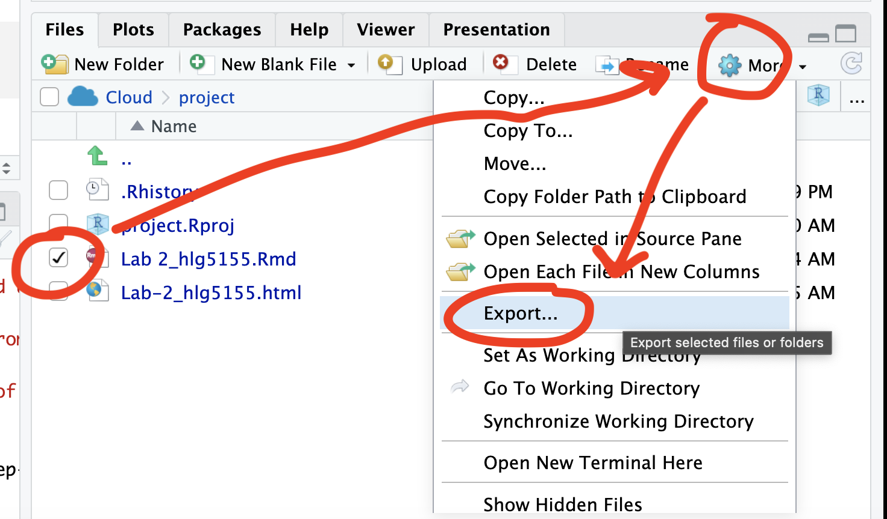

```{r, include=FALSE, echo=FALSE,results='hide',warning=FALSE, message = FALSE}
knitr::opts_chunk$set(echo = TRUE, warning=FALSE, message = FALSE)

# THE FORMAT YOU LIKE IS LAB 3 INSIDE 2022

# invisible data read
library(tidyverse)
library(sp)
library(sf)
library(readxl)
library(skimr)
library(ggplot2)
library(tmap)
library(viridis)
library(kableExtra)
library(plotly)
library(readxl)
library(osmdata)


```

<br>

## Welcome to Lab 3!

The aim of this lab is to start looking at tables of data and to make your first maps.

By the end of this week's lab, you will be able to:

-   

    1.  Make a markdown template

-   

    2.  Read in data from an excel file

-   

    3.  Conduct exploratory data analysis

-   

    4.  Wrangle a table of data

-   

    5.  Make initial plots and maps

The lab is worth 110 points and there is a rubric at the end of this page.

```{=html}
<p class="comment"><strong>THIS IS A TWO WEEK LAB. You have two full lab sessions, then, assignment 3 is due the week afterwards.</strong></p>
```
<br><br>


## A: Set up - DON'T SKIP

<br>

#### Step A1. Files & Projects

<details>
<summary>POSIT CLOUD people, expand for set up</summary>
<br>

**Step i:**<br>Go to <https://posit.cloud/content/> and make a new project for Lab 3 <br><br>

**Step ii:**<br>Run this code IN THE CONSOLE to install the packages you need. <br>

 -  This is going to take 5-10 minutes, so let it run and carry on. <br><br>
 

```{r, eval=FALSE}

install.packages("readxl")
install.packages("tidyverse")
install.packages("ggplot2")
install.packages("dplyr")

install.packages("remotes")

remotes::install_github(repo = "r-spatial/sf", 
                        ref = "93a25fd8e2f5c6af7c080f92141cb2b765a04a84")

install.packages("terra")
install.packages("tmap")
install.packages("elevatr")
install.packages("nasapower")
install.packages("osmdata")
install.packages("tigris")
install.packages("rmdformats")


# If you get a weird error it might be that the quote marks have messed up. 
# Replace all of them and ask Dr G for a shortcut.

```
<br><br>

**Step iii:   **<br>Go to the Lab Canvas page and download these 3 files.  Upload each one into your project folder.<br>*Forgotten how? See Lab 2 Set-Up.* <br>

   1. Your PERSONAL UFO dataset (look for the csv file with your email ID). <br>
   2. Your PERSONAL Spatial State-level dataset. <br>
   3. The lab report template .RmD file.<br>
   
     
<br>
</details>
 
<br>
<details>
<summary>R-DESKTOP people, expand for set up</summary>

<br>

**Step i:**<br>Create a new project for Lab 3.<br>*Forgotten how? See Lab 2 Set-Up.*<br><br>

**Step ii:**<br>Go to the Lab Canvas page and download these 3 files.<br> Put each one in your Lab 3 project folder. <br>

   1. Your PERSONAL UFO dataset (look for the csv file with your email ID). <br>
   2. Your PERSONAL Spatial State-level dataset. <br>
   3. The lab report template .RmD file.<br><br>
   
**Step iii:**<br>Open the Lab report template and try to knit. Install any packages you are missing (either via clicking the little yellow bar or by clicking Packages/Install)  <br><br>

</details>
<br><br>

#### Step A2. Change the theme


<details>
<summary>Instructions</summary>
<br>

This is more for us when we're grading!  It helps us to not go insane when we're reading 60 reports.<br><br>

**Step i:**  Change the AUTHOR line to your personal E-mail ID <br><br>
 
**Step ii:**  Go here and choose a theme out of downcute, robobook, material, readthedown or html_clean: <https://github.com/juba/rmdformats?tab=readme-ov-file#formats-gallery>.<br> *DO NOT CHOOSE html_docco - it doesn't have a table of contents*  <br><br>
 
**Step iii:**<br>Change the theme line on the template YAML code to a theme of your choice. See the example YAML code below <br>
*Note, downcute chaos is different - see below*<br><br>

 1. Example YAML code if you want `robobook`, `material`, `readthedown` or `html_clean`. You can also change the highlight option to change how code chunks look. - see the rmdformats website.

```{r,eval=FALSE}

---
title: "Lab 3"
author: "ADD YOUR EMAIL ID"
date: "`r Sys.Date()`"
output:
  rmdformats::robobook:
    self_contained: true
    highlight: kate
---

```

<br>

 2. Example YAML code if you want `downcute` or `downcute chaos`. For white standard downcute, remove the downcute_theme line.

```{r,eval=FALSE}

---
title: "Lab 3"
author: "ADD YOUR EMAIL ID"
date: "`r Sys.Date()`"
output:
  rmdformats::downcute:
    self_contained: true
    downcute_theme: "chaos"
    default_style: "dark"
---
      
```

<br><br>
</details>
<br><br>

#### Step A3. Knit and check it looks good.


<br><br>

## B: UFO Analysis.

You have each been given some (genuine) about UFOs for a specific US State.  Because you all have unique data, you will all get different results and so you can work together.

<br>

#### Step B1. Summarise the datasets


<details>
<summary>Instructions</summary>
<br>


**Step i:** 
First, learn about the UFO data (you will write about it in Step 3). Look at these websites and BRIEFLY note down to yourself,, how was the data collected? Why? e.g. what were the people who collected the data trying to achieve?  Also note down any other relevant information you can see. E.g. is data stored as points or polygons etc.  <br>

 - The raw data was collected from here: <https://nuforc.org/>  <br>
 
  - The actual data was obtained from here <https://github.com/planetsig/ufo-reports>  <br>
 

<br>
**Step ii:** 
You are also going to be using some data from the US government American Community Survey (you will write about it in Step 3). Look at these resources and BRIEFLY note down to yourself, how was the data collected? Why? e.g. what were the people who collected the data trying to achieve?  Also note down any other relevant information you can see. E.g. is data stored as points or polygons etc.  <br>

 - You can read about it here: <https://www.socialexplorer.com/help/faq/knowledge-base/american-community-survey-basics>  <br>
 
  - Or there are a LOAD of youtube videos and resources out there  <br>
 
<br>
**Step iii:** 
In the appropriate spot in your report - write a paragraph about each dataset. Feel free to include pictures or anything else you like! (visual mode) <br>


<br><br>
</details>
<br><br>

#### Step B2. Load the data into R

<details>
<summary>Instructions</summary>
<br>

**Step i:**<br>
In the appropriate spot in your report, use the `read_csv` command to load your UFO data into R (remember it needs to be in your project folder).<br><nr> View it and note the variables and object of analysis in your paragraph about the data. 


**Step ii:**<br>
In the appropriate spot in your report, use the `st_read` command to load your ACS data into R (remember it needs to be in your project folder).<br><nr> View it and note the variables and object of analysis in your paragraph about the data. 

<br>


<br><br>

## Step D. Submitting your Lab

Remember to save your work throughout and to spell check your writing (next to the save button). Now, press the knit button again. If you have not made any mistakes in the code then R should create a html file in your lab folder, complete with a very recent time-stamp.

<br>

### If you are on posit cloud:

You can download each of your .RmD and html files by:

 - Clicking on the little box next to the Rmd in the Files tab, then going to the little blue cogwheel (might need to make your Rstudio full screen) and clicking export.<br>

```{r, LabFigDownload, echo=FALSE,fig.align='center',out.width="90%"}

```


 - Repeat the process exactly for the html file underneath it (e,g, just have the html clicked.)<br>
 
 - Now go to Canvas and submit BOTH your html and your .Rmd file in Lab .


<br>

### Posit desktop

 - Go to your Lab  folder,  In that folder, double click on the html file. This will open it in your browser. CHECK THAT THIS IS WHAT YOU WANT TO SUBMIT <br>

- Now go to Canvas and submit BOTH your html and your .Rmd file in Lab .<br>

```{r, echo=FALSE}
knitr::include_graphics("./index_images/pg_364Lab1_Basics_2021_fig1.png")
```

<br>

## Lab 3 submission check-list

**HTML FILE SUBMISSION - 15 marks**

**RMD CODE SUBMISSION - 15 marks**

**MARKDOWN/CODE STYLE - 20 MARKS**

Your code and document is neat and easy to read. LOOK AT YOUR HTML FILE IN YOUR WEB-BROWSER BEFORE YOU SUBMIT. There is also a spell check next to the save button. You have written your answers below the relevant code chunk in full sentences in a way that is easy to find and grade. For example, you have written in full sentences, it is clear what your answers are referring to.

**CODE SHOWCASE - 20 MARKS**

**LAST FROST DATE - 40 MARKS**


[110 marks total]

Overall, here is what your lab should correspond to:

```{r, echo=FALSE}
rubric <- readxl::read_excel("pg_364Lab_rubrictable.xlsx")
knitr::kable(rubric) %>%   
  kable_classic_2() %>%
  kable_styling(bootstrap_options = c("striped", "hover", "responsive"))


```

------------------------------------------------------------------------------------------------------------------------

Website created and maintained by [Helen Greatrex](https://www.geog.psu.edu/directory/helen-greatrex). Website template by [Noli Brazil](https://nbrazil.faculty.ucdavis.edu/)
