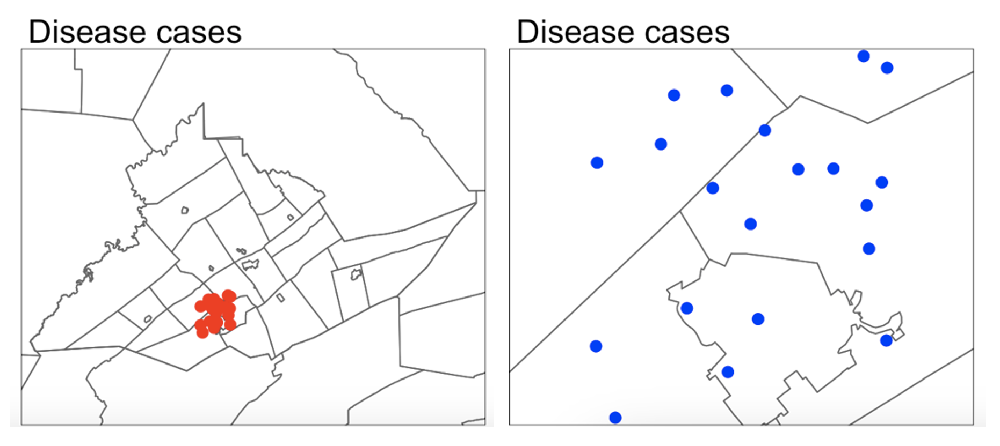
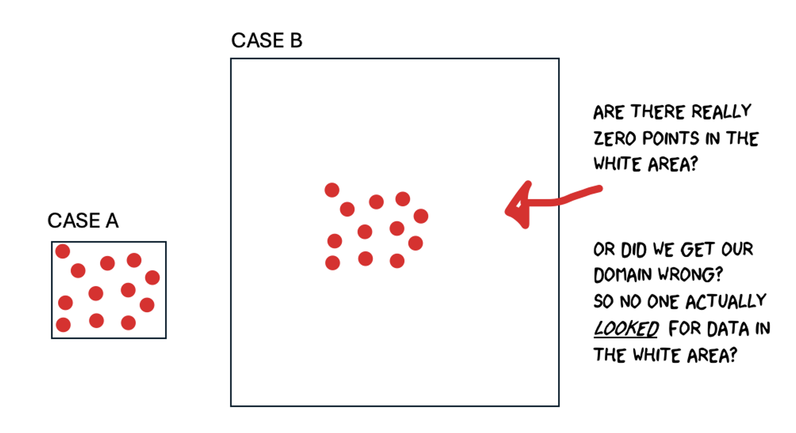

```{r, include=FALSE, echo=FALSE,results='hide',warning=FALSE, message = FALSE}
knitr::opts_chunk$set(echo = TRUE, warning=FALSE, message = FALSE)

# THE FORMAT YOU LIKE IS LAB 3 INSIDE 2022

# invisible data read
library(tidyverse)
library(sp)
library(sf)
library(readxl)
library(skimr)
library(ggplot2)
library(tmap)
library(viridis)
library(kableExtra)
library(plotly)
library(readxl)
library(osmdata)
library(tigris)
library(elevatr)


```

<br>

## Welcome to Lab 4!

### Aims

-   Today’s lab explores the concepts of **Domain (environment)**, **Location**, **Distance** and **Neighborhood** and tests useful tools.

-   Next week (4B), we pull these tools together to study **Connection**, specifically **autocorrelation**.

-   In addition, you will learn skills such as downloading data from OpenStreetMap and how to use the "sfdep" package.

<br>

```{=html}
<p class="comment"><strong>THIS IS A TWO WEEK LAB. <br>You have two full lab sessions, then, assignment 4 is due the week afterwards.<br>The lab is worth 110 points and there is a rubric at the end of this page.</strong></p>
```
<br><br>

## WEEK 1

### A: Set up - DON'T SKIP

#### Step A1. Files & Projects

<details>

<summary>POSIT CLOUD people, expand for set up</summary>

<br>

**Step i:**<br>Go to <https://posit.cloud/content/> and make a new project for Lab 3 <br><br>

**Step ii:**<br>Run this code IN THE CONSOLE to install the packages you need. <br>

-   This is going to take 5-10 minutes, so let it run and carry on. <br><br>

```{r, eval=FALSE}

install.packages("readxl")
install.packages("tidyverse")
install.packages("ggplot2")
install.packages("dplyr")
install.packages("remotes")

remotes::install_github(repo = "r-spatial/sf", 
                        ref = "93a25fd8e2f5c6af7c080f92141cb2b765a04a84")
install.packages("terra")
install.packages("tmap")
install.packages("elevatr")
install.packages("nasapower")
install.packages("osmdata")
install.packages("tigris")
install.packages("rmdformats")
install.packages("plotly")
install.packages("ggstatsplot")
install.packages("spdep")
install.packages("osmdata")
install.packages("units")


# If you get a weird error it might be that the quote marks have messed up. 
# Replace all of them and ask Dr G for a shortcut.

```

<br><br>

**Step iii:** <br>Go to the Lab Canvas page and download these 4 files. Upload each one into your project folder.<br>*Forgotten how? See Lab 2 Set-Up.* <br>

1.  TWO "mystery datasets". <br>
2.  The lab report template .RmD file.<br>

<br>

</details>

::: small-gap
:::

<details>

<summary>R-DESKTOP people, expand for set up</summary>

<br>

**Step i:**<br>Create a new project for Lab 4.<br>*Forgotten how? See Lab 2 Set-Up.*<br><br>

**Step ii:**<br>Go to the Lab Canvas page and download these files. Put them in your project folder for Lab 4<br>

1.  TWO "mystery datasets". <br>
2.  The lab report template .RmD file.<br>

**Step iii:**<br>Open the Lab report template and try to run the library code chunk file. Install any packages you are missing (either via clicking the little yellow bar or by clicking Packages/Install) <br><br>

</details>

<br>

#### Step A2. Change the theme

<details>

<summary>Instructions</summary>

<br>

This is more for us when we're grading! It helps us to not go insane when we're reading 60 reports.<br><br>

**Step i:** Change the AUTHOR line to your personal E-mail ID <br><br>

**Step ii:** Go here and choose a theme out of downcute, robobook, material, readthedown or html_clean: <https://github.com/juba/rmdformats?tab=readme-ov-file#formats-gallery>.<br> *DO NOT CHOOSE html_docco - it doesn't have a table of contents* <br><br>

**Step iii:**<br>Change the theme line on the template YAML code to a theme of your choice. See the example YAML code below <br> *Note, downcute chaos is different - see below*<br><br>

1.  Example YAML code if you want `robobook`, `material`, `readthedown` or `html_clean`. You can also change the highlight option to change how code chunks look. - see the rmdformats website.

```{r,eval=FALSE}

---
title: "Lab 4"
author: "ADD YOUR EMAIL ID"
date: "`r Sys.Date()`"
output:
  rmdformats::robobook:
    self_contained: true
    highlight: kate
---

```

<br>

2.  Example YAML code if you want `downcute` or `downcute chaos`. For white standard downcute, remove the downcute_theme line.

```{r,eval=FALSE}

---
title: "Lab 4"
author: "ADD YOUR EMAIL ID"
date: "`r Sys.Date()`"
output:
  rmdformats::downcute:
    self_contained: true
    downcute_theme: "chaos"
    default_style: "dark"
---
      
```

<br><br>

</details>

<br><br>

### B: Core spatial attributes

In spatial statistics, **Domain (environment)**, **Location**, **Distance**, **Neighborhood**, and **Connection** form the foundation of understanding spatial relationships and patterns in data.

Expand to read the collected summaries of why each is important. They are short and it will put the lab into context of the lectures/exams. There is nothing to write/submit here, but it will save you time later.

<details>

<summary>**READ THESE SUMMARIES**</summary>

<br>

```{=html}
<p class="comment"><strong>DOMAIN:</strong><br> In traditional statistics, we assume that our sample is randomly selected, independent and completely representative of the underlying population. Spatial data however, is tied to physical space and all its complexity. The spatial domain describes both the environment or area within which your data exists and defines the spatial boundaries of your analysis.</p>
```
::: small-gap
:::

```{=html}
<p class="comment"><strong>LOCATION:</strong><br> Every spatial analysis starts with the location of an object or event. By knowing where something happens, we can begin to ask spatial questions—such as, "What is near it?" or "How do other events relate to this one?".</p>
```
::: small-gap
:::

```{=html}
<p class="comment"><strong>DISTANCE:</strong><br> The distance between locations tells us how spatially separated objects are, which helps us understand potential interactions. For instance, nearby points may share common factors, while distant points may behave independently. Spatial analysis often explores whether proximity leads to similarity or differences.</p>
```
::: small-gap
:::

```{=html}
<p class="comment"><strong>NEIGHBOURHOOD:</strong><br> A neighborhood defines the spatial context around a location. By determining what qualifies as a 'neighbor' (whether based on distance or shared boundaries), we can study patterns of clustering or dispersion, and how events influence each other across space.</p>
```
::: small-gap
:::

```{=html}
<p class="comment"><strong>CONNECTION:</strong><br> Connection examines the relationships between locations, such as movement or interactions (e.g., trade routes, traffic, or social interactions). Understanding these connections helps in analyzing spatial networks and interaction patterns, such as how diseases spread or how resources are accessed.<br><br> For example, in lab 4B, we explore Spatial Autocorrelation refers to the idea that objects close to each other in space may be more similar (positive autocorrelation) or more different (negative autocorrelation) than those farther apart. This relies heavily on the concepts of neighborhood and distance, as these define which locations are considered "close" enough to be related and influence one another.</p>
```
<br><br>

</details>

<br><br>

### C: Domain

The spatial domain describes both the environment or area within which your data exists and defines the spatial boundaries of your analysis. If this domain is misrepresented—either by including irrelevant areas or excluding critical regions—it can distort the results and lead to incorrect inferences about spatial patterns.

There is no perfect domain for two reasons:

<details>

<summary>**1. It depends on your needs**</summary>

<br>

In part your choice of domain is going to depend on WHY you are looking at the data. As we have seen in class, patterns such as clustering are scale dependent - and so are the processes that cause them. So you might choose a certain domain depending on your needs.

For example, consider the figure below, where I have plotted the same data at two different scales:

-   For example, a CDC representative for Pennsylvania might be interested in considering the entire area as their 'domain' if they want to understand the progression of a disease outbreak. At the moment it's clearly clustered in State College - useful information that can lead directly to action.

-   They might ALSO be interested in analyzing the data across a smaller domain to see if they can identify locations where the disease is being spread (say one hall-of-residence). In this case, it’s clear we don’t see a single easy cluster of cases. In fact they seem to be rather uniformly spread out ( maybe that the locational fallacy is at play?)

{width="100%"}

<br><br>

</details>

::: small-gap
:::

<details>

<summary>**Your data must have an equal chance of appearing anywhere in your domain, or all your statistical tests won’t work**</summary>

<br>

Your sample is must be representative of your population, so ALL THE STATISTICS TESTS assume that there is an equal chance that any location within your domain could contain data.

-   If you make your domain too big, your data will appear to be is clustered, but in fact you just didn’t collect data in part of the domain.

For example, if you were asked to assess if the dots in case A and B below were arranged uniformly or were clustered together, you would have very different outcomes, despite the dots themselves being identical.

{width="100%"}

<br><br>

</details>

::: small-gap
:::

<details>

<summary>**Its also CRUCIAL to consider the "non-uniformity of space**</summary>

<br>

As we discussed above, there should be an equal chance of seeing your data anywhere in your domain. BUT.. Unlike traditional statistics, where sampling is assumed to be random and uniform, spatial data is more nuanced—landscape features, political borders, and human activity vary greatly across space. Knowing these features can greatly change your interpretation.

This effect is called the ‘non uniformity of space’ – when we know more information about the background map than we can see in our actual data.

For example:

-   Is an area with low population density in a city linked to 'a lack of data collection', 'a lake/park' or some sociopolitical reason? Just looking at population density won't tell you the answer, we also need to look at the background map.

-   Equally, data might look clustered, but in fact there are just areas where it's not possible to have points. For example, without the nuance of the background map you might get very different conclusions from an analysis of bike parking in Helsinki:

{width="100%"}

<br>

**So consider the non uniformity of space when designing your domain**

Your domain doesn’t have to be square! So we are balancing the need for our domain to only contain landscapes that have an 'equal chance' of seeing our data (e.g. we can't get bike parking in the ocean', vs the complexity of making your domain so complex that you can't get anything done. This also links to the spatial fallacy of "fuzzy borders"

<br><br>

</details>

<br>

#### Exercise. Data detective

<details>

<summary>**Expand and complete!**</summary>

<br>

I recently found two ‘mystery files’ on her desktop that I had forgotton to name correctly.

I know they must be from two of these four experiments:

1.  A cluster analysis of COVID cases in central PA

2.  A cluster analysis of Mediterranean vineyards

3.  A cluster analysis of Smooth-Hound Sharks

4.  A cluster analysis of polar bears.

To work out which experiments the data was from, I read them both into R and made these maps... which didn't help much!

{width="100%"}

<br>

##### Step C1

-   If you haven't already, GO AND DO THE SET-UP SECTION. You should now have your project running, your libraries installed and your Lab 4 report open.

<br>

##### Step C3

-   In the appropriate place in your lab report, explain (in at least 100 words), how knowledge of the “the non-uniformity of space” can help solve my problem above.

<br>

##### Step C3

-   Then, IN YOUR LAB REPORT, read each of the mystery datasets into R using the \`st_read()\` command. <br> *Hint: If you can't remember how to do this, refer to your Lab 3 report where you read your state level acs data into R..*

<br>

##### Step C4

-   In your lab report, explore and map the data. Remember that there are mapping tutorials in Lav 3 and Lab 2 - or here, <https://r-tmap.github.io/tmap-book/layers.html>\

-   In your report, work out which experiment each dataset matches (see the exercise intro). Explain your reasoning, providing common-sense evidence linking to your explanation of the non uniformity of space <br> *Hint this isn't meant to be a trick, it should be pretty simple.* <br> *Hint 2, If you're stuck, remember interactive mode tm_mode("view").*

<br>

##### Step C5

-   In your lab report, for EACH of the two datasets and given my experiment aims, describe what would be an appropriate spatial domain and whether you consider the objects to be clustered or uniformly distributed. Explain your reasoning.

Note, no code is needed; your answer can be in words (50 words at least per dataset).

<br><br>

</details>

<br><br>

### D: Describing location and distance

Here, we are going to practice downloading data from Open Street Map and to look at some of the different ways to assess distance and location. Specifically we're going to explore at the locations of firestations.

#### Exercise. Getting vector data from Open Street map

<details>

<summary>**Expand and complete!**</summary>

<br>

R connects easily with the website OpenStreetMap. This is becoming a crucial resource in spatial statistics, although the data can be messy (it's being entered by volunteers).

##### Step D1

-   Watch the 2 minute video below about open street map and go and explore it here <https://www.openstreetmap.org/>. You can also read more about its background and get help here: <https://wiki.openstreetmap.org/wiki/About_OpenStreetMap>

-   In the appropriate spot in your report, write at least 100 words describing Open Street Map and explaining why its useful.

<iframe width="560" height="315" src="https://www.youtube.com/embed/Phwrgb16oEM?si=xwWWBkKSr4MpLAiA" title="YouTube video player" frameborder="0" allow="accelerometer; autoplay; clipboard-write; encrypted-media; gyroscope; picture-in-picture; web-share" referrerpolicy="strict-origin-when-cross-origin" allowfullscreen>

</iframe>

<br>

##### Step D2

-   This code will load the locations of all the Fire-Stations in Chicago into R. Copy carefully into your report and run.

```{r, results='hide', eval=FALSE}
# Get a RECTANGULAR bounding box for Chicago
bbox_city_rectangle <- getbb("Chicago, USA") 

# Now query OpenStreetMap 
fire_stationdata <- opq(bbox = bbox_city_rectangle) %>%
     add_osm_feature(key = "amenity", value = "fire_station") %>%
     osmdata_sf()

# Look at the data
fire_stationdata
```

<br>

-   You should see a list of the data you have just downloaded. This command returns EVERYTHING related to fire stations in the area and you can see that there is space for every type of vector data, in our case 1586 points and 165 polygons. From a quick glance, I think the polygons refer to firestation buildings and the points are ANYTHING fire-service related.

-   Click here to understand what you just did: <https://www.youtube.com/watch?v=kcpiH6dDWLE>

-   To read more about how OSM stores fire-station data, see here - <https://wiki.openstreetmap.org/wiki/Emergency_facilities_and_amenities>

<br>

##### Step D3

-   The point data is often messy (people adding fire-hoses etc). So we are going to focus on the polygon fire station buildings.
-   Add this command into your lab script and run. This will turn fire-stations into the type of spatial file you are used to.

```{r, results='hide', eval=FALSE}
fire_station_buildings <- fire_stationdata$osm_polygons
```

<br>

##### Step D4

-   Make a map of the fire stations in Chicago, remembering if you are using tmap that you are using tm_polygons() NOT tm_dots().

<br>

##### Step D5

-   It's clear our polygons are VERY small compared to the overall area. And in terms of the topic, I don't really care how big the firestation buildings are, just that they exist. So let's choose the MEAN CENTRE and convert it into points.\
    \
    As we discussed in class, there are a few ways to do this. Given that we don't really care about the shape of our buildings, lets use st_centroid, which will find the "centre of mass" of each building.

    \
    \
    

-   Add this command into your lab script and run. This will convert the fire station data into points. It might give you a warning about geometries, ignore it!

```{r, results='hide', eval=FALSE}
fire_stations <- st_centroid(fire_station_buildings)
```

<br>

##### Step D6

In your report, Make a map of the fire station locations (points) - it will be easier to make out a pattern. Describe the features of the pattern you see and what you think might be causing it.

You should see something like this:

{width="90%"}

<br><br>

## YIFEI, FINAL BIT OF WEEK 1 TO COME

<br><br>

## WEEK 2 TO COME

<br><br>

## SUBMITTING YOUR LAB

Remember to save your work throughout and to spell check your writing (next to the save button). Now, press the knit button again. If you have not made any mistakes in the code then R should create a html file in your lab2 folder, complete with a very recent time-stamp.

<br>

### If you use the POSIT cloud website

You can download each of your .RmD and html files by:

-   Clicking on the little box next to the Rmd in the Files tab, then going to the little blue cogwheel (might need to make your Rstudio full screen) and clicking export.<br>

```{r, Lab2FigDownload, echo=FALSE,fig.align='center',out.width="90%"}
knitr::include_graphics('./index_images/im_T2_Download.png')
```

-   Repeat the process exactly for the html file underneath it (e,g, just have the html clicked.)<br>

-   Now go to Canvas and submit BOTH your html and your .Rmd file in Lab 3

<br>

### If you use the RSTudio desktop on your own computer

-   Press knit!

-   Go to your Lab 3 folder, In that folder, double click on the html file. This will open it in your browser. CHECK THAT THIS IS WHAT YOU WANT TO SUBMIT <br>

-   Now go to Canvas and submit BOTH your html and your .Rmd file in Lab 3.<br>

```{r, echo=FALSE}
knitr::include_graphics("./index_images/pg_364Lab1_Basics_2021_fig1.png")
```

<br>

## GRADING CHECK-LIST

to be added

[110 marks total]

### What does your grade mean?

Overall, here is what your lab should correspond to:

```{r, echo=FALSE}
rubric <- readxl::read_excel("pg_364Lab_rubrictable.xlsx")
knitr::kable(rubric) %>%   
  kable_classic_2() %>%
  kable_styling(bootstrap_options = c("striped", "hover", "responsive"))


```
