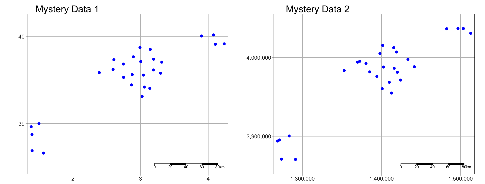
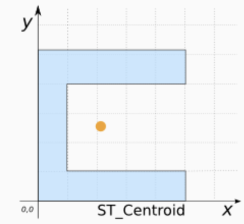

```{r, include=FALSE, echo=FALSE,results='hide',warning=FALSE, message = FALSE}
knitr::opts_chunk$set(echo = TRUE, warning=FALSE, message = FALSE)

# THE FORMAT YOU LIKE IS LAB 3 INSIDE 2022

# invisible data read
library(tidyverse)
library(sp)
library(sf)
library(readxl)
library(skimr)
library(ggplot2)
library(tmap)
library(viridis)
library(kableExtra)
library(plotly)
library(readxl)
library(osmdata)
library(tigris)
library(elevatr)


```

<br>

## Welcome to Lab 4!

### Aims

-   Today’s lab explores the concepts of **Domain (environment)**, **Location**, **Distance** and **Neighborhood** and tests useful tools.

-   Next week (4B), we pull these tools together to study **Connection**, specifically **autocorrelation**.

-   In addition, you will learn skills such as downloading data from OpenStreetMap and how to use the "sfdep" package.

<br>

```{=html}
<p class="comment"><strong>THIS IS A TWO WEEK LAB. <br>You have two full lab sessions, then, assignment 4 is due the week afterwards.<br>The lab is worth 110 points and there is a rubric at the end of this page.</strong></p>
```
<br><br>

## WEEK 1

### A: Set up - DON'T SKIP

#### Step A1. Files & Projects

<details>

<summary>POSIT CLOUD people, expand for set up</summary>

<br>

**Step i:**<br>Go to <https://posit.cloud/content/> and make a new project for Lab 3 <br><br>

**Step ii:**<br>Run this code IN THE CONSOLE to install the packages you need. <br>

-   This is going to take 5-10 minutes, so let it run and carry on. <br><br>

```{r, eval=FALSE}

install.packages("readxl")
install.packages("tidyverse")
install.packages("ggplot2")
install.packages("dplyr")
install.packages("remotes")

remotes::install_github(repo = "r-spatial/sf", 
                        ref = "93a25fd8e2f5c6af7c080f92141cb2b765a04a84")
install.packages("terra")
install.packages("tmap")
install.packages("elevatr")
install.packages("nasapower")
install.packages("osmdata")
install.packages("tigris")
install.packages("rmdformats")
install.packages("plotly")
install.packages("ggstatsplot")
install.packages("spdep")
install.packages("osmdata")
install.packages("units")


# If you get a weird error it might be that the quote marks have messed up. 
# Replace all of them and ask Dr G for a shortcut.

```

<br><br>

**Step iii:** <br>Go to the Lab Canvas page and download these 4 files. Upload each one into your project folder.<br>*Forgotten how? See Lab 2 Set-Up.* <br>

1.  TWO "mystery datasets". <br>
2.  The lab report template .RmD file.<br>

<br>

</details>

::: small-gap
:::

<details>

<summary>R-DESKTOP people, expand for set up</summary>

<br>

**Step i:**<br>Create a new project for Lab 4.<br>*Forgotten how? See Lab 2 Set-Up.*<br><br>

**Step ii:**<br>Go to the Lab Canvas page and download these files. Put them in your project folder for Lab 4<br>

1.  TWO "mystery datasets". <br>
2.  The lab report template .RmD file.<br>

**Step iii:**<br>Open the Lab report template and try to run the library code chunk file. Install any packages you are missing (either via clicking the little yellow bar or by clicking Packages/Install) <br><br>

</details>

<br>

#### Step A2. Change the theme

<details>

<summary>Instructions</summary>

<br>

This is more for us when we're grading! It helps us to not go insane when we're reading 60 reports.<br><br>

**Step i:** Change the AUTHOR line to your personal E-mail ID <br><br>

**Step ii:** Go here and choose a theme out of downcute, robobook, material, readthedown or html_clean: <https://github.com/juba/rmdformats?tab=readme-ov-file#formats-gallery>.<br> *DO NOT CHOOSE html_docco - it doesn't have a table of contents* <br><br>

**Step iii:**<br>Change the theme line on the template YAML code to a theme of your choice. See the example YAML code below <br> *Note, downcute chaos is different - see below*<br><br>

1.  Example YAML code if you want `robobook`, `material`, `readthedown` or `html_clean`. You can also change the highlight option to change how code chunks look. - see the rmdformats website.

```{r,eval=FALSE}

---
title: "Lab 4"
author: "ADD YOUR EMAIL ID"
date: "`r Sys.Date()`"
output:
  rmdformats::robobook:
    self_contained: true
    highlight: kate
---

```

<br>

2.  Example YAML code if you want `downcute` or `downcute chaos`. For white standard downcute, remove the downcute_theme line.

```{r,eval=FALSE}

---
title: "Lab 4"
author: "ADD YOUR EMAIL ID"
date: "`r Sys.Date()`"
output:
  rmdformats::downcute:
    self_contained: true
    downcute_theme: "chaos"
    default_style: "dark"
---
      
```

<br><br>

</details>

<br><br>

### B: Core spatial attributes

In spatial statistics, **Domain (environment)**, **Location**, **Distance**, **Neighborhood**, and **Connection** form the foundation of understanding spatial relationships and patterns in data.

Expand to read the collected summaries of why each is important. They are short and it will put the lab into context of the lectures/exams. There is nothing to write/submit here, but it will save you time later.

<details>

<summary>**READ THESE SUMMARIES**</summary>

<br>

```{=html}
<p class="comment"><strong>DOMAIN:</strong><br> In traditional statistics, we assume that our sample is randomly selected, independent and completely representative of the underlying population. Spatial data however, is tied to physical space and all its complexity. The spatial domain describes both the environment or area within which your data exists and defines the spatial boundaries of your analysis.</p>
```
::: small-gap
:::

```{=html}
<p class="comment"><strong>LOCATION:</strong><br> Every spatial analysis starts with the location of an object or event. By knowing where something happens, we can begin to ask spatial questions—such as, "What is near it?" or "How do other events relate to this one?".</p>
```
::: small-gap
:::

```{=html}
<p class="comment"><strong>DISTANCE:</strong><br> The distance between locations tells us how spatially separated objects are, which helps us understand potential interactions. For instance, nearby points may share common factors, while distant points may behave independently. Spatial analysis often explores whether proximity leads to similarity or differences.</p>
```
::: small-gap
:::

```{=html}
<p class="comment"><strong>NEIGHBOURHOOD:</strong><br> A neighborhood defines the spatial context around a location. By determining what qualifies as a 'neighbor' (whether based on distance or shared boundaries), we can study patterns of clustering or dispersion, and how events influence each other across space.</p>
```
::: small-gap
:::

```{=html}
<p class="comment"><strong>CONNECTION:</strong><br> Connection examines the relationships between locations, such as movement or interactions (e.g., trade routes, traffic, or social interactions). Understanding these connections helps in analyzing spatial networks and interaction patterns, such as how diseases spread or how resources are accessed.<br><br> For example, in lab 4B, we explore Spatial Autocorrelation refers to the idea that objects close to each other in space may be more similar (positive autocorrelation) or more different (negative autocorrelation) than those farther apart. This relies heavily on the concepts of neighborhood and distance, as these define which locations are considered "close" enough to be related and influence one another.</p>
```
<br><br>

</details>

<br><br>

### C: Domain

The spatial domain describes both the environment or area within which your data exists and defines the spatial boundaries of your analysis. If this domain is misrepresented—either by including irrelevant areas or excluding critical regions—it can distort the results and lead to incorrect inferences about spatial patterns.

There is no perfect domain for two reasons:

<details>

<summary>**1. It depends on your needs**</summary>

<br>

In part your choice of domain is going to depend on WHY you are looking at the data. As we have seen in class, patterns such as clustering are scale dependent - and so are the processes that cause them. So you might choose a certain domain depending on your needs.

For example, consider the figure below, where I have plotted the same data at two different scales:

-   For example, a CDC representative for Pennsylvania might be interested in considering the entire area as their 'domain' if they want to understand the progression of a disease outbreak. At the moment it's clearly clustered in State College - useful information that can lead directly to action.

-   They might ALSO be interested in analyzing the data across a smaller domain to see if they can identify locations where the disease is being spread (say one hall-of-residence). In this case, it’s clear we don’t see a single easy cluster of cases. In fact they seem to be rather uniformly spread out ( maybe that the locational fallacy is at play?)

{width="100%"}

<br><br>

</details>

::: small-gap
:::

<details>

<summary>**Your data must have an equal chance of appearing anywhere in your domain, or all your statistical tests won’t work**</summary>

<br>

Your sample is must be representative of your population, so ALL THE STATISTICS TESTS assume that there is an equal chance that any location within your domain could contain data.

-   If you make your domain too big, your data will appear to be is clustered, but in fact you just didn’t collect data in part of the domain.

For example, if you were asked to assess if the dots in case A and B below were arranged uniformly or were clustered together, you would have very different outcomes, despite the dots themselves being identical.

{width="100%"}

<br><br>

</details>

::: small-gap
:::

<details>

<summary>**Its also CRUCIAL to consider the "non-uniformity of space**</summary>

<br>

As we discussed above, there should be an equal chance of seeing your data anywhere in your domain. BUT.. Unlike traditional statistics, where sampling is assumed to be random and uniform, spatial data is more nuanced—landscape features, political borders, and human activity vary greatly across space. Knowing these features can greatly change your interpretation.

This effect is called the ‘non uniformity of space’ – when we know more information about the background map than we can see in our actual data.

For example:

-   Is an area with low population density in a city linked to 'a lack of data collection', 'a lake/park' or some sociopolitical reason? Just looking at population density won't tell you the answer, we also need to look at the background map.

-   Equally, data might look clustered, but in fact there are just areas where it's not possible to have points. For example, without the nuance of the background map you might get very different conclusions from an analysis of bike parking in Helsinki:

{width="100%"}

<br>

**So consider the non uniformity of space when designing your domain**

Your domain doesn’t have to be square! So we are balancing the need for our domain to only contain landscapes that have an 'equal chance' of seeing our data (e.g. we can't get bike parking in the ocean', vs the complexity of making your domain so complex that you can't get anything done. This also links to the spatial fallacy of "fuzzy borders"

<br><br>

</details>

<br>

#### Exercise. Data detective

<br>

I recently found two ‘mystery files’ on her desktop that I had forgotten to name correctly.

I know they must be from two of these four experiments:

1.  A cluster analysis of COVID cases in central PA

2.  A cluster analysis of Mediterranean vineyards

3.  A cluster analysis of Smooth-Hound Sharks

4.  A cluster analysis of polar bears.

To work out which experiments the data was from, I read them both into R and made these maps... which didn't help much!

{width="100%"}

<br>

##### Step C1

-   If you haven't already, GO AND DO THE SET-UP SECTION. You should now have your project running, your libraries installed and your Lab 4 report open.

<br>

##### Step C3

-   In the appropriate place in your lab report, explain (in at least 100 words), how knowledge of the “the non-uniformity of space” can help solve my problem above.

<br>

##### Step C3

-   Then, IN YOUR LAB REPORT, read each of the mystery datasets into R using the \`st_read()\` command. <br> *Hint: If you can't remember how to do this, refer to your Lab 3 report where you read your state level acs data into R..*

<br>

##### Step C4

-   In your lab report, explore and map the data. Remember that there are mapping tutorials in Lav 3 and Lab 2 - or here, <https://r-tmap.github.io/tmap-book/layers.html>\

-   In your report, work out which experiment each dataset matches (see the exercise intro). Explain your reasoning, providing common-sense evidence linking to your explanation of the non uniformity of space <br> *Hint this isn't meant to be a trick, it should be pretty simple.* <br> *Hint 2, If you're stuck, remember interactive mode tm_mode("view").*

<br>

##### Step C5

-   In your lab report, for EACH of the two datasets and given my experiment aims, describe what would be an appropriate spatial domain and whether you consider the objects to be clustered or uniformly distributed. Explain your reasoning.

Note, no code is needed; your answer can be in words (50 words at least per dataset).

<br><br>


### D: Distance & closeness

Now we are going to practice downloading data from Open Street Map and to look at some of the different ways to assess distance and location. Specifically we're going to explore at the locations of fire stations in Chicago.

<br>

#### Exercise. Getting vector data from Open Street map


R connects easily with the website OpenStreetMap. This is becoming a crucial resource in spatial statistics, although the data can be messy (it's being entered by volunteers).

::: small-gap
:::

##### Step D1 - Learn about Open Street Map

<details>
<summary>**Expand and complete!**</summary>
<br>

-   Watch the 2 minute video below about open street map and go and explore it here <https://www.openstreetmap.org/>. You can also read more about its background and get help here: <https://wiki.openstreetmap.org/wiki/About_OpenStreetMap>

-   In the appropriate spot in your report, write at least 100 words describing Open Street Map and explaining why its useful.

<iframe width="560" height="315" src="https://www.youtube.com/embed/Phwrgb16oEM?si=xwWWBkKSr4MpLAiA" title="YouTube video player" frameborder="0" allow="accelerometer; autoplay; clipboard-write; encrypted-media; gyroscope; picture-in-picture; web-share" referrerpolicy="strict-origin-when-cross-origin" allowfullscreen>

</iframe>

<br><br>
</details>
::: small-gap
:::


##### Step D2 - Get the data

<details>
<summary>**Expand and complete!**</summary>
<br>


-   This code will load the locations of all the Fire-Stations in Chicago into R. Copy carefully into your report and run.

```{r, results='hide', eval=FALSE}
# Get a RECTANGULAR bounding box for Chicago
bbox_city_rectangle <- getbb("Chicago, USA") 

# Now query OpenStreetMap 
fire_stationdata <- opq(bbox = bbox_city_rectangle) %>%
     add_osm_feature(key = "amenity", value = "fire_station") %>%
     osmdata_sf()

# Look at the data
fire_stationdata
```

<br>

-   You should see a list of the data you have just downloaded. This command returns EVERYTHING related to fire stations in the area and you can see that there is space for every type of vector data, in our case 1586 points and 165 polygons. From a quick glance, I think the polygons refer to fire station buildings and the points are ANYTHING fire-service related.

-   Click here to understand what you just did: <https://www.youtube.com/watch?v=kcpiH6dDWLE>

-   To read more about how OSM stores fire-station data, see here - <https://wiki.openstreetmap.org/wiki/Emergency_facilities_and_amenities>

<br><br>
</details>
::: small-gap
:::


##### Step D3 - Extract polygons & map

<details>
<summary>**Expand and complete!**</summary>
<br>

-   The point data is often messy (people adding fire-hoses etc). So we are going to focus on the polygon fire station buildings.
-   Add this command into your lab script and run. This will turn fire-stations into the type of spatial file you are used to.

```{r, results='hide', eval=FALSE}
fire_station_buildings <- fire_stationdata$osm_polygons
```


- Now, Make a map of the fire stations in Chicago, remembering if you are using tmap that you are using tm_polygons() NOT tm_dots().

<br><br>
</details>
::: small-gap
:::


##### Step D4 - Find centroids & map

<details>
<summary>**Expand and complete!**</summary>
<br>

-   It's clear our polygons are VERY small compared to the overall area. And in terms of the topic, I don't really care how big the fire station buildings are, just that they exist. So let's choose the MEAN CENTRE and convert it into points.\
    \
    As we discussed in class, there are a few ways to do this. Given that we don't really care about the shape of our buildings, lets use st_centroid, which will find the "centre of mass" of each building.

    \
    \
    

-   Add this command into your lab script and run. This will convert the fire station data into points. It might give you a warning about geometries, ignore it!

```{r, results='hide', eval=FALSE}
fire_stations <- st_centroid(fire_station_buildings)
```

<br><br>

 - In your report, Make a map of the fire station locations (points e.g. tm_dots) - it will be easier to make out a pattern. Describe the features of the pattern you see and what you think might be causing it.

You should see something like this:

{width="90%"}
<br><br>
</details>
<br><br>

#### Exercise. Closest stations

Now we have the fire station locations, we want to consider "neighbourhood".  Which fire-stations are *closest* to one another and what does "closest" even mean?

This is a genuine issue faced by emergency authorities. For example, it is needed when considering which stations deserve new vehicles, or where to put new stations.

Have a look at this report, which explores the issue for Columbus Ohio - and which gets to use several billion pieces of data.. <https://storymaps.arcgis.com/stories/0037b3eb93904ed6aa00cbba424af0da>.  It was completed by one of our MGIS alumni, Rob Ford.

<br>

##### Step D5 - Measuing distance

<details>
<summary>**Expand for instructions**</summary>
<br>

In your report, come up with AT LEAST three different ways that you could measure the 'closeness' or 'distance' between fire-stations. Use the reading above to justify your answers. We will also talk about this in class.

<br><br>

</details>

<br><br><br>


## WEEK 2


```{=html}
<p class="comment"><strong>DOMAIN:</strong><br> I AM NOW LETTING YOU SORT OUT YOUR OWN STRUCTURE/HEADINGS/SUB-HEADINGS ETC.  Please make it easy to grade and to find your answers (20% of your grade is on style..).  For example, write in full sentences, make sure all the plots etc make sense and that your code is neat, using headings/sub-headings/bullets etc.  </p>
```
::: small-gap
:::


<br>

Re-open your project, re-open your .RmD lab report and run all the code chunks. Your report & R-Studio should look something like the screenshot below (it might not be _identical_ but it should be similar).  


{width="100%"}


<br><br>

### E. Removing variables

Especially for people using POSIT-Cloud, it's good practice to remove large datasets and variables that you're not planning to use.   In our case, we are ONLY planning to use the fire_station point locations, so we can remove the other data using the `rm()` command

<details>
<summary>**Expand for instructions**</summary>
<br>

This is by no means essential, but it gives your computer a _tiny_ bit more energy to run code, alongside keeping everything neat. 

This command will remove your Chicago bounding box and your large fire_stationdata variables. 

```{r,eval=FALSE}
rm(bbox_city_rectangle)
rm(fire_stationdata)
```
 
 


 - Go to the end of your lab report. <br><br>
 - Make a new section heading called Week 2. <br><br>
 - Inside, make a new code chunk and copy the code above into it.  Add a third line to remove the fire_station_buildings variable.<br><br>
 - Run the code chunk.  You should see the variables disappear in the environment tab.  Nothing else should happen. 
 

<br><br>
</details>
<br><br>


### F. Subsetting to the South-East Side

<br>

|                                                                                                                                                                                                                   |                                                      |
|------------------------|----------------------------------------|
| <br><br> _Chicago has a set internal neighbourhoods, arranged informally into "sides" e.g. "Northside", "SouthSide"... These neighbourhood are not federally recognized, but they are used by the city and by local people.  So.. we can access this data via downloading it from Chicago's City Data Portal._ <br><br>Let's subset to a smaller dataset, because I know that the people on POSIT-Cloud have been struggling.  Specifically, we are going to focus on South East Chicago. | [{width="800"}](https://commons.wikimedia.org/wiki/File:Chicago_community_areas_map.svg) |


<br>


#### Step F1. Get the boundary data & read into R


<details>
<summary>**Expand for instructions**</summary>
<br><br>


 - Go to this website. <https://data.cityofchicago.org/Facilities-Geographic-Boundaries/Boundaries-Community-Areas-current-/cauq-8yn6>

 - On the top right, click Export, then choose the GeoJSON format. Move/upload the file into your project folder.
 
 {width="80%"}

<br><br>

 
 - In your lab report, read the data into R using the `st_read()` command - e.g. copy/paste the code-chunk below:
 
```{r, eval=FALSE}
CommunityAreas <- st_read("Boundaries - Community Areas (current).geojson")
CommunityAreas

# make a quick map
qtm(CommunityAreas)
```
 
 - Your map should look like Chicago boundaries.
 
 

<br><br>
</details>

::: small-gap
:::


#### Step F2. Select our area of interest.

<details>
<summary>**Expand for instructions**</summary>
<br> 
 
 
 - We are going to focus on the following community areas in the far South East of the city:
 
    - "ROSELAND"
    - "PULLMAN"
    - "SOUTH DEERING"
    - "EAST SIDE"
    - "WEST PULLMAN"
    - "RIVERDALE"
    - "HEGEWISCH"
 
 <br>
 
 - In your lab report, make a new code chunk and copy this code across to filter to these communities. If you get a weird error, try re-typing the quote marks.

```{r, eval=FALSE}
CommunityAreas_SE <- CommunityAreas  %>%
   filter(community %in% c("ROSELAND",
                           "PULLMAN",
                           "SOUTH DEERING",
                           "EAST SIDE",
                           "WEST PULLMAN",
                           "RIVERDALE",
                           "HEGEWISCH"))

# make a quick map
qtm(CommunityAreas_SE)

```


<br><br>
</details>
::: small-gap
:::


#### Step F3. Subset the fire-stations to this area.

<details>
<summary>**Expand for instructions**</summary>
<br> 
 


 - Finally, we're going to use the `st_intersection()` command to select only the fire stations within our chosen communities.
 
  - In your lab report, make a new code chunk and copy/run this code to filter to these communities. 
  
```{r, eval=FALSE}

# Subset the firestations
 fire_station_local <- st_intersection(fire_stations, 
                                       CommunityAreas_SE)


# Make a quick plot
 tm_shape(CommunityAreas_SE) +
   tm_borders() +
   tm_shape(fire_station_local) +
   tm_dots(col = "red", size = 0.5)+
   tmap_mode("view")
```
 
 
<br><br>
</details>
::: small-gap
:::


#### Step F4. Questions

<details>
<summary>**Expand for instructions**</summary>
<br>  

I want to check your understanding of what we have just done.  So after the code, please answer the following questions in your lab report.  Remember you can look at the data by clicking its name in the environment tab, or by using summary(), head(), table() etc.

1. How many fire stations are inside CommunityAreas_SE? <br><br>
2. How many unique zip-codes/post-codes are there in the fire_station_local data? <br> _(hint, table command.  <br>hint2. there is a useful column inside fire_station_local called addr.postcode)_ <br><br>
3. Are there any fire-stations in Riverdale?  If so, how many? <br>  _(hint, look at the community column in fire_station_local data...)_ 

<br><br>
</details>
<br><br>


 
### G. Measuring distance in R

As discussed in class, there are several ways we can measure distance using R-Studio.  Here, we are going to explore cartesian distance (e.g. "as the crow flies" or straight line distance) and driving distance using Open Street map.

<br>

#### Step G1. Calculating distance code

<details>
<summary>**Expand for instructions**</summary>
<br>  

The code below will calculate the straight-line and driving distance between two locations in our dataset.

 - We can calculate the straight-line distance between two objects using the st_distance() command.  This defaults to calculating distances in metres, so I often change it to km.

 - We can calculate driving distances (and routes) between two objects using the osrmRoute() command. You can also choose walking or cycling.
 
<br> 
 
**YOU NEED A NEW PACKAGE! <br> GO TO THE PACKAGES TAB INSTALL/DOWNLOAD THE `osrm` package. <br>THEN SCROLL UP TO YOUR LIBRARY CODE CHUNK IN YOUR REPORT. ADD `library(osrm)` AND RUN THE CODE CHUNK. THEN SCROLL BACK DOWN TO THE END OF YOUR REPORT**  

 - Copy these code chunks into your report, understand what they are doing and run them. You should see that the cartesian distance is ~2.19km and the driving distance ~3.04km, alongside a map.
 

```{r, eval=FALSE}
# Choose which locations you want to look at the distance between
# In our case, we are choosing objects/rows from our firestation data.
# They could be row numbers you type manually or some sort of filter
# I am showing you both examples
 
location1 <- fire_station_local[1,]
location2 <- dplyr::filter(fire_station_local,osm_id == "210429692")
```

<br>

```{r, eval=FALSE}
# Calculate the straight line distance
Distance_Cartesian_m  <- st_distance(location1,location2)
Distance_Cartesian_km <- as.numeric(Distance_Cartesian_m/1000)
Distance_Cartesian_km
```

<br>

```{r, eval=FALSE}
# And driving distance 
Distance_Driving <- osrmRoute(src = location1,dst = location2,
                              overview = "full",osrm.profile="car")
Distance_Driving

```

<br>

```{r, eval=FALSE}

# To plot the straight line distance we need to manually
# create a straight line between our locations
line_between <- st_cast(st_union(location1, location2), "LINESTRING")

# Step 4: Plot both lines and annotate them
tm_shape(line_between) +
   tm_lines(col = "red", lwd = 2, title.col = "Euclidean Line") +
   tm_shape(Distance_Driving) +
   tm_lines(col = "blue", lwd = 2, title.col = "Driving Line") +
   tm_shape(fire_station_local) +
   tm_dots() + tm_legend()+
   tmap_mode("view")

```


<br><br>
</details>

<br>

#### Step G2. Challenge

<details>
<summary>**Expand for instructions**</summary>
<br>

 - Choose two fire-stations that are "close" in terms of straight-line distance, but "far apart" in terms of driving distance.

 - Hint, try running `qtm(fire_station_local) + tm_text("osm_id")` to help you work out which station is which.

 - In your report, edit the code (above) that you just ran to calculate the distance between your chosen stations. Run the code and make a map of the two distances. <br>
 _Hint You ONLY need to edit the row numbers in the first code chunk then run_

 - Justify why you chose those two stations in your lab report. (You don't have to be right, you just have to have some reasoning why you chose those two points).


<br><br>
</details>

<br><br>

### H. Spatial weights matrix - POINTS

As discussed in class this week, a spatial matrix is a way of recording the distances between objects - and we can use them to make a spatial weights matrix defining the neighbourhood.

<br>

#### Step H1. Distance matrices

<details>
<summary>**Expand for instructions**</summary>
<br>

Cartesian distance matrices 

 - These are VERY easy.  This is all the code you need. <br><br>
 
 - Copy/run this code chunk,  <br><br>

```{r, eval=FALSE}
# you just run the st_distance command with a table of 
# data rather than two points. I divided by 1000 to put it in km.
Distmatrix_cartesian <- round(st_distance(fire_station_local)/1000,3)
Distmatrix_cartesian

```

<br><br>

Driving distance matrices

 - Driving distance matrices are much harder and rely on Dr G's custom code. If you want to see how to scale this up, come to an office hr with Dr G.   <br><br>

 - Copy/run this code chunk  <br><br>


```{r, eval=FALSE}
#---------------------------------------------------------
# Calculate the DRIVING distance between each pair of fire stations
# Copy/paste this code chunk EXACTLY
#---------------------------------------------------------
# Extract coordinates
fire_station_coords <- st_coordinates(st_geometry(fire_station_local))

# Create a matrix to store driving distances
num_stations     <- nrow(fire_station_coords)
Distmatrix_drive <- matrix(NA, nrow = num_stations, ncol = num_stations)

# Generate unique station pairs for the upper triangle
pairs <- expand.grid(1:num_stations, 1:num_stations)
pairs <- pairs[pairs$Var1 < pairs$Var2, ]

for(n in 1:nrow(pairs)){
   drivedist <- osrmRoute(src = fire_station_coords[pairs[n,1], ],
                      dst = fire_station_coords[pairs[n,2], ],
                      overview = FALSE,osrm.profile="car")[2]

   Distmatrix_drive[pairs[n,1], pairs[n,2]] <- as.numeric(drivedist)
   Distmatrix_drive[pairs[n,2], pairs[n,1]] <- as.numeric(drivedist)
}

Distmatrix_drive

```


CHALLENGE

Look up your two points in the two matrices and confirm that they match your first calculation and what you expect from Lecture 8A.  Visusalising these matrices is hard because they have units assigned (Dr G is working on it).  So you don't need to do anything here if the code is running.


<br><br>
</details>
<br><br>

 
### I. Neighbourhood

<br>

Now we have "distance" we can decide which fire-stations are "neighbours" of each other.  This will lead to a "spatial weights matrix" where  1 = DEFINITELY a neighbour and 0 = DEFINITELY not a neighbour.  Sometimes we can choose to have a sliding scale between the two.

**NOTE:  No-one has written a package (yet!) that calculates the neighbourhood for driving distances, so we are going to focus on the cartesian distances for the rest of the lab**

<br>

##### Step I1. Nearest Neighbours

<details>
<summary>**Expand for instructions**</summary>
<br>

The `st_knn()` command will automatically work out the nearest neighbours for straight-line distances. Copy/run the code below.   To change the number of nearest neighbours, just change k and re-run.


```{r, eval=FALSE}

# Closest neighbour 
knn_cartesian <- st_knn(st_geometry(fire_station_local), k = 1)
knn_cartesian

# It's old fashioned in that it can only be plotted in a certain way, 
# Just copy/paste this.
# Spatial weights are a special type of data that tmap hates.
# 
# Get coordinates 
fire_station_coords <- st_coordinates(fire_station_local)
# And plot.
plot(st_geometry(fire_stations),
     col = "blue", pch = 16,cex=.6,
     main = "Fire Stations and Their Neighbors")
plot(knn_cartesian, coords = fire_station_coords, col = "red")
plot(st_geometry(CommunityAreas_SE),add=TRUE)


```

 - CHALLENGE.  In your lab report, change k from 1,2,3,4,5... and re-run the code.  Describe what you see and explain what is happening in your lab report. 
 
 

<br><br>
</details>
::: small-gap
:::


##### Step I2. Distance bands

<details>
<summary>**Expand for instructions**</summary>
<br>

The `dnearneigh()` command will automatically work out the nearest neighbours for straight-line distances. Copy/run the code below.   To change the number of nearest neighbours, just change k and re-run.


```{r, eval=FALSE}
# This suggests a "neighbour" is any object less than 3000m away.
dnn <- dnearneigh(coords, d1 = 0, d2 = 3000)

# Assuming distance band
coords <- st_coordinates(fire_station_local)
plot(st_geometry(fire_stations),
     col = "blue", pch = 19,
     main = "Fire Stations and Their Neighbors")
plot(dnn, coords, add=TRUE, col = "red")
print(dnn)

```

 - CHALLENGE.  In your lab report, change d2 from 3000 to 1000, 2000, 4000... and re-run the code.  Describe what is happening and explain what is happening in your lab report.


<br><br>
</details>
::: small-gap
:::


<br>

##### Step I3. Summary.

Imagine you are working with Chicago authorities to work out how fire-stations should share resources and territory.  Which type/order of spatial weights matrix would you choose and why?  Explain your answer in your lab report.

<br><br>


### J. Spatial weights matrix - POLYGONS


Finally, I want you to see the code for assessing the spatial weights matrices of polygons.  

 - Here are two examples that should run.   Copy/run the code in your report


```{r, eval=FALSE}
coords <- st_coordinates(st_centroid(CommunityAreas_SE))

rook_neighbors <- st_contiguity(CommunityAreas_SE, queen=FALSE)
queen_neighbors <- st_contiguity(CommunityAreas_SE, queen=TRUE)


# and plot - they might come out small. not sure why
plot(st_geometry(CommunityAreas_SE))
plot(rook_neighbors, coords, add=TRUE, col = "red", main="Rook's 1st order")


plot(st_geometry(CommunityAreas_SE))
plot(queen_neighbors, coords, add=TRUE, col = "blue",main="Queen's 1st order")


```


 - In your report, please explain what each one is doing and how they define "neighbour".   Hint, see Lecture 8A...

<br><br>

### K. TIDY YOUR REPORT! 

A lot of this week's lab was showcasing some of the commands that we've spoken about in the lectures. So go back and make your report neat, with headings and subheadings so its easy to find the answers, answers are written up in full sentences, you've removed any unneeded code or text.  


<br><br>

### WHERE WE'RE GOING

Because of the big shifts with the R spatial code, it's proving tricky to make sure your lab actually works.  So if you finish this quickly, here is the direction next week is going...

 - https://mgimond.github.io/Spatial/spatial-autocorrelation.html
 - https://mgimond.github.io/Spatial/spatial-autocorrelation-in-r.html 

Reading these examples now will make week 2 MUCH easier.

<br><br>

## SUBMITTING YOUR LAB


Remember to save your work throughout and to spell check your writing (next to the save button). Now, press the knit button again. If you have not made any mistakes in the code then R should create a html file in your lab2 folder, complete with a very recent time-stamp.

<br>

### If you use the POSIT cloud website 

You can download each of your .RmD and html files by:

 - Clicking on the little box next to the Rmd in the Files tab, then going to the little blue cogwheel (might need to make your Rstudio full screen) and clicking export.<br>

```{r, Lab2FigDownload, echo=FALSE,fig.align='center',out.width="90%"}
knitr::include_graphics('./index_images/im_T2_Download.png')
```


 - Repeat the process exactly for the html file underneath it (e,g, just have the html clicked.)<br>
 
 - Now go to Canvas and submit BOTH your html and your .Rmd file in Lab 3


<br>

### If you use the RSTudio desktop on your own computer

 - Press knit!
 
 - Go to your Lab 4 folder,  In that folder, double click on the html file. This will open it in your browser. CHECK THAT THIS IS WHAT YOU WANT TO SUBMIT <br>

- Now go to Canvas and submit BOTH your html and your .Rmd file in Lab 4.<br>

```{r, echo=FALSE}
knitr::include_graphics("./index_images/pg_364Lab1_Basics_2021_fig1.png")
```

<br>

## GRADING CHECK-LIST


[110 marks total]


### What does your grade mean?

Overall, here is what your lab should correspond to:

```{r, echo=FALSE}
rubric <- readxl::read_excel("pg_364Lab_rubrictable.xlsx")
knitr::kable(rubric) %>%   
  kable_classic_2() %>%
  kable_styling(bootstrap_options = c("striped", "hover", "responsive"))


```


