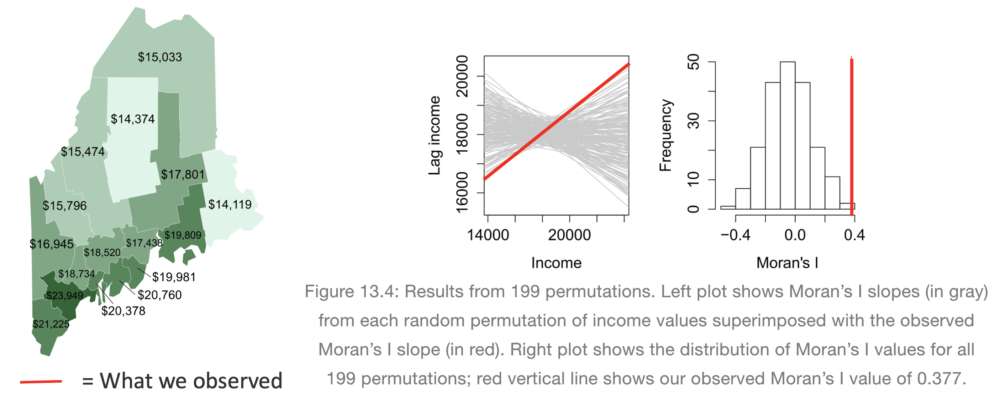
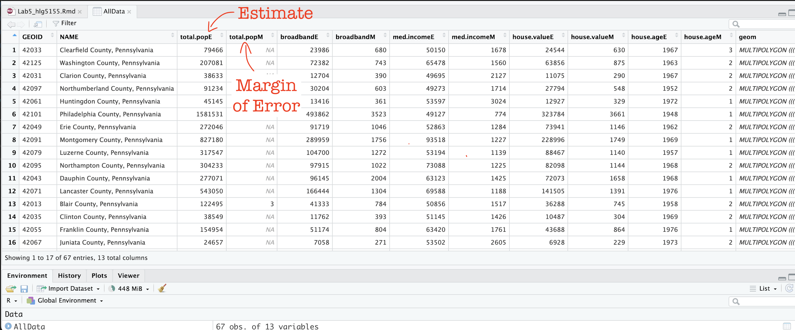
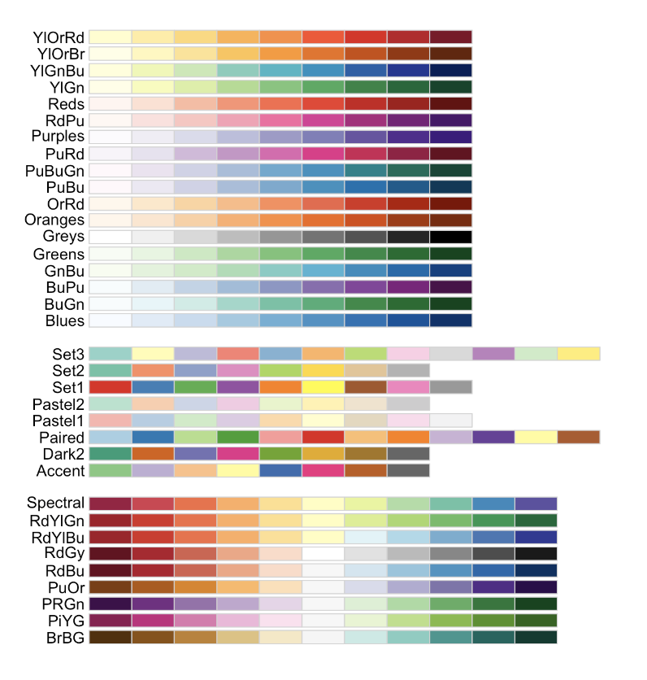
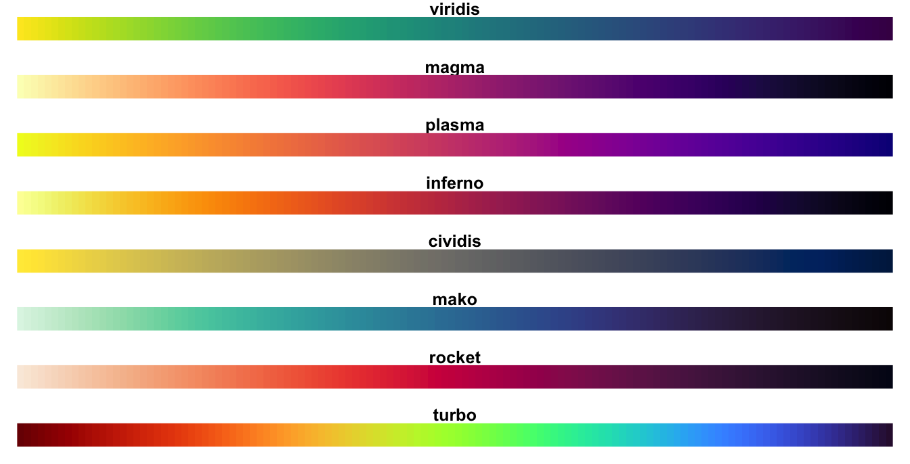

```{r, include=FALSE, echo=FALSE,results='hide',warning=FALSE, message = FALSE}
knitr::opts_chunk$set(echo = TRUE, warning=FALSE, message = FALSE)

# THE FORMAT YOU LIKE IS LAB 3 INSIDE 2022

# invisible data read
library(tidyverse)
library(sp)
library(sf)
library(readxl)
library(skimr)
library(ggplot2)
library(tmap)
library(viridis)
library(kableExtra)
library(plotly)
library(readxl)
library(osmdata)
library(tigris)
library(elevatr)
library(tidycensus)

```

<br>

## Welcome to Lab 5 Week 1 !

<br>

### Aims

Today’s lab explores autocorrelation and Moran's I, covering scatterplots hypothesis tests, and next week, Local Moran's I, LISA. In addition, you will build on last week's datacamp to use tidycensus data. <br>

```{=html}
<p class="comment"><strong>THIS IS A TWO WEEK LAB. <br>You have two full lab sessions, then, Lab 5 is due the week afterwards.<br>The lab is worth 110 points and there is a rubric at the end of this page.</strong></p>
```
<br><br>

## A. Set-up

Seriously, please don't skip this. It's the biggest cause of lab issues.

<br>

### A1. Create a Lab 5 project

First, you need to set up your project folder for lab 5, and install packages if you are on the cloud.

<details>

<summary>POSIT CLOUD people, click here to install packages..</summary>

<br>

**Step i:**<br>Go to <https://posit.cloud/content/> and make a new project for Lab 5 <br><br>

**Step ii:**<br>Run this code IN THE CONSOLE to install the packages you need. <br>

-   This is going to take 5-10 minutes, so let it run and carry on. <br><br>

```{r, eval=FALSE}

# COPY/PASTE THIS IN THE CONSOLE QUADRANT, 
# DON'T PUT IT IN A CODE CHUNK 

install.packages("readxl")
install.packages("tidyverse")
install.packages("ggplot2")
install.packages("ggstatsplot")
install.packages("plotly")
install.packages("dplyr")
install.packages("skimr")
install.packages("rmdformats")

install.packages("remotes")
remotes::install_github(repo = "r-spatial/sf", 
                        ref = "93a25fd8e2f5c6af7c080f92141cb2b765a04a84")

install.packages("terra")
install.packages("tidycensus")
install.packages("tigris")
install.packages("tmap")
install.packages("units")
install.packages("spdep")
install.packages("sfdep")

# If you get a weird error it might be that the quote marks have messed up. 
# Replace all of them and ask Dr G for a shortcut.

```

<br><br>

**Step iii:** <br>Go to the Lab Canvas page and download the data AND the lab report. Upload each one into your project folder.<br>*Forgotten how? See Lab 2 Set-Up.* <br>

<br>

</details>

::: small-gap
:::

<details>

<summary>R-DESKTOP people, click here to create your lab project.</summary>

<br>

::: collapsible-content
<iframe src="pindent_Tut2b_ProjectsDesktop.html" style="width: 100%; height: 700px; border: none;">

</iframe>
:::

</details>

<br><br>

### A2. Add your data & lab template

Go to Canvas and download the lab template and datasets for this week's lab. Should be one dataset and one lab template. Immediately put it in your lab 5 folder (or upload it if you're on the cloud. Rename the lab template to something with your email ID, then open it.

<br><br>

### A3. Change the YAML Code

The YAML code sets up your final report. Changing the theme also helps us to not go insane when we're reading 60 reports. Expand for what you need to do.<br>

<details>

<summary>Step A3 Instructions</summary>

<br>

**Step i:** Change the AUTHOR line to your personal E-mail ID <br><br>

**Step ii:** Go here and choose a theme out of downcute, robobook, material, readthedown or html_clean: <https://github.com/juba/rmdformats?tab=readme-ov-file#formats-gallery>.<br> *DO NOT CHOOSE html_docco - it doesn't have a table of contents* <br><br>

**Step iii:**<br>Change the theme line on the template YAML code to a theme of your choice. See the example YAML code below <br> *Note, downcute chaos is different - see below*<br><br>

1.  Example YAML code if you want `robobook`, `material`, `readthedown` or `html_clean`. You can also change the highlight option to change how code chunks look. - see the rmdformats website.

```{r,eval=FALSE}

---
title: "Lab 5"
author: "ADD YOUR EMAIL ID"
date: "`r Sys.Date()`"
output:
  rmdformats::robobook:
    self_contained: true
    highlight: kate
---

```

<br>

2.  Example YAML code if you want `downcute` or `downcute chaos`. For white standard downcute, remove the downcute_theme line..

```{r,eval=FALSE}

---
title: "Lab 5"
author: "ADD YOUR EMAIL ID"
date: "`r Sys.Date()`"
output:
  rmdformats::downcute:
    self_contained: true
    downcute_theme: "chaos"
    default_style: "dark"
---
      
```

<br><br>

</details>

<br><br>

### A4. Add the library code chunk

**DO NOT SKIP THIS STEP (or any of them!).** Now you need to create the space to run your libraries. Expand for what you need to do.<br>

<details>

<summary>Step A4 Instructions</summary>

<br>

**Step i:** At the top of your lab report, add a new code chunk and add the code below. <br><br>

**Step ii:** Change the code chunk options at the top to read <br> `{r, include=FALSE, warning=FALSE, message=FALSE}` and try to run the code chunk a few times <br><br>

**Step iii:** If it works, all 'friendly text' should go away. If not, look for the little yellow bar at the top asking you to install anything missing, or read the error and go to the install 'app-store' to get any packages you need. <br><br>

```{r, eval=FALSE}

# IF spdep causes issues, remove and run again. sfdep SHOULD be able to do everything spdep does, it's just pretty new. 

  rm(list=ls())
  library(plotly)
  library(raster)
  library(readxl)
  library(sf)
  library(skimr)
  library(spdep)
  library(sfdep)
  library(tidyverse)
  library(tidycensus)
  library(terra)
  library(tmap)
  library(dplyr)
  library(tigris)
  library(tmap)
  library(units)
  library(viridis)
  library(ggstatsplot)

  options(tigris_use_cache = TRUE)

```

<br><br>

</details>

<br><br><br>

## **STOP AND CHECK**

```{=html}
<p class="comment"><strong>STOP!</strong> Your screen should look similar to the screenshot below (although your lab 5 folder would be inside GEOG364).<strong>If not, go back and redo the set-up!</strong></p>
```
{width="100%"}

<br><br><br>

## B: Moran's theory showcase

You are first going to practice Moran's I hypothesis tests in R - with questions that link to lectures in Week 10 and 11 (this week and last), and the two recent discussions on Canvas. You need to answer these in your section "B. Moran's showcase".

You will get style marks for making your answers easy to find (sub-headings!), clear and understandable. You lose marks for saying incorrect things or providing vague examples.

<br>

### Question B1.

-   [**[100 words min]**]{.underline} In your own words, define **spatial autocorrelation**, distinguishing between **positive, zero** and **negative** spatial autocorrelation. Describe how each type of autocorrelation is represented in the Moran’s I metric, and provide a real-world example for each case to illustrate these concepts (either text or including a picture/photo you describe). <br>

<br>

### Question B2.

-   [**[50 words min]**]{.underline} Explain why traditional statistical tests become challenging when working with data that exhibits spatial autocorrelation. \<br\> (hint, think about the assumptions we normally make when taking a sample). <br>

<br>

### Question B3.

-   *"**H~0~**: Any "pattern" we see is spurious - the data shows Complete Spatial Randomness and is created by an Independent Random Process."*

This week we discussed how a hypothesis test, **H~0~**, represents a specific scenario we want to test, and that the **p-value** gives us the probability of observing some aspect of our data if that scenario were true. We also covered that the simplest baseline scenario to check is whether any observed pattern could be due to an **Independent Random Process**.

<br>

-   [**[50 words min]**]{.underline} Explain what Independent Random Process is, and how it links with Complete Spatial Randomness and spatial autocorrelation.<br>

<br>

### Question B4.

-   [**[50 words min]**]{.underline} Explain what a Monte Carlo ^[1]^ process is, and how we use them to conduct a Moran's hypothesis test. E.g. explain the figure below. <br> [1] Also known as bootstrapping or an ensemble process. <br> (*Hint, lecture 11A and [https://mgimond.github.io/Spatial/spatial-autocorrelation-in-r.html#app8_5](#0){.uri}* ) <br>\

    ~*[1] Otherwise known as bootstrapping, ensembles or "repeating a process over and over.."*~

{width="100%"}

<br><br>

## REAL EXAMPLE (REST OF LAB)

## C. Wrangling Census data

The way the rest of this lab is structured is that we going to work through an example of analyzing census data using R and testing it for autocorrelation. In this section we get all the columns we need, do some quality control and get everything neat and ready.

<br>

### C1. Get the data

Your data comes from the American Community Survey, a big government dataset that is used alongside the the US Census. We will be looking at county level demographic data for Pennsylvania.

Normally, I would get you to directly download your data using using `tidycensus`, but the website that provides accreditation is not working. So, I created it for you and you can simply read in the file.. <br>

-   I**f you haven't already downloaded the data, GO BACK AND DO THE SET UP!** <br><br>
-   **Now read the data into R using the st_read command and save it as a variable called AllData e.g. `AllData <- st_read("PennACS.gpkg")`**

<br>

#### How Dr G got the census data  

*I download the data directly from the American Community Survey using `tidycensus`. **You do not have to do this,** but just in case, you might need it in real life, here is my code and a tutorial.*

<br>

<details>

<summary>Expand for a tidycensus tutorial <br> (you do not need this for this lab)</summary>

<br>

```{r, results="hide",warning=FALSE, message = FALSE,eval=FALSE}

# This comes from the tidycensus library
PennACS.sf <- get_acs(
                survey = "acs5", 
                year   = 2020, 
                state  = "PA", 
                geography = "county", 
                geometry  = TRUE, 
                output = "wide",
                variables = c(total.pop = "B05012_001",# Total population
                         med.income  = "B19013_001",# Median income 
                         total.house = "B25001_001",# Total housing units
                         broadband   = "B28002_004",# Houses with internet
                         house.value = "B25075_001",# House value 
                         house.age   = "B25035_001"))# House age

# Then I save your data to a file, which you can access on canvas
st_write(PennACS.sf,"PennACS.gpkg")

```

To understand what I'm doing, here's a full tutorial that I wrote a few years ago:

::: collapsible-content
<iframe src="https://psu-spatial.github.io/Geog364-2021/pg_Tut6_input_output.html#Tutorial_6E:_Reading_in_US_Census_Data" style="width: 100%; height: 700px; border: none;">

</iframe>
:::

</details>

<br><br>

### C2. Estimates vs margins of error

In the previous step, you should have read in the data.

**Now click on/View `AllData` to take a look and understand what is there.**

You should now see that you have census data for Pennsylvania at a county level for these variables. In fact, for every one, it has downloaded the ESTIMATE, but also has included the MARGIN-OF-ERROR, the 90% confidence interval on our result (90% of the time our result should be within this margin of error)

-   The total population in each county (`total.popE` and `total.popM`)

-   Median income of people in each county (`med.incomeE` and `med.incomeM`)

-   The total number of houses in each county (`total.houseE` and `total.houseM`)

-   The total number of houses with broadband in each county (`broadbandE` and `broadbandM`)

-   Mean House Value in each county (`house.valueE` and `house.valueM`)

-   Mean House Age in each county (`house.ageE` and `house.ageM`)

*Note a few columns are slightly different here - I rearranged them after making the screenshot*

{width="100%"}

<br><br>

### C3. Tidy the data

First, let's remove the margin of error columns using dplyr select. They are normally very useful, but I want things as clear as possible for this lab. We can also make a working version of the data. <br>\

-   **The code below shows how to select and rename columns. Copy it over into your lab report and check it runs. You do not need to edit anything,**
    -   **`select()`**: Lists all the columns you want to keep, leaving out the "M" columns.

    -   **`rename()`**: Renames each selected column, removing the "E" suffix for each specified column.

```{r, eval=FALSE}
PennACS_sf <- AllData %>% 
              dplyr::select(
                GEOID, NAME, total.popE, 
                med.incomeE, total.houseE, broadbandE, 
                house.valueE, house.ageE, geom) %>%
              dplyr::rename(
                total.pop = total.popE,
                med.income = med.incomeE,
                total.house = total.houseE,
                broadband = broadbandE,
                house.value = house.valueE,
                house.age = house.ageE)

```

<br><br>

### C4. Calculate county areas

We currently have the TOTAL number of people/houses/beds/things in each county, but it is also useful to have the percentage or rate, especially as each of our counties is a different size. First, let's get the areas.

-    **Copy this code over into your lab report and check it runs. You do not need to edit anything,**

```{r, eval=FALSE}

#Finding the area of each county 
Area_M2 <- st_area(PennACS_sf)

# This is in metres^2. Convert to Km sq and add it as a new column
# and get rid of the annoying units format
PennACS_sf$Area_km2 <- set_units(Area_M2, "km^2")
PennACS_sf$Area_km2 <- round(as.numeric(PennACS_sf$Area_km2), 2)

```

<br><br>

### C5. Calculate rates and densities

We currently have the TOTAL number of people/houses/beds/things in each county, but it is also useful to have the percentage or rate, especially as each of our counties is a different size.

<br>

1.  **Copy this code over into your lab report and check it runs. You do not need to edit anything,** This example which will calculate the percentage of people in each county who use broadband and save as a new column called broadband_percent.<br>

```{r, eval=FALSE}

PennACS_sf <- mutate(PennACS_sf, broadband_percent = broadband/total.house)

```

<br>

2.  Make a new code chunk, copy/paste this code then edit it so that you create a new column called pop.density and calculate the number of people per square km (hint, you have your new Area_km2 column..) <br>

    *HINT - If `mutate` doesn’t make sense, see this tutorial: <https://crd150.github.io/lab2.html#Creating_new_variables>*

<br><br>

### C6. Check for empty polygons

Now.. one quirk of R is that it hates empty polygons.

IF YOU GET ERRORS PLOTTING, I BET THIS IS WHAT IS HAPPENING.

In the census we often get them, for example there might be a polygon around a lake that doesn't actually have people living there. So first, let's check for and remove any empty polygons. Get this code running in your report.

-   **Copy the code below into your lab report and check it runs. You do not need to edit anything,**

```{r, eval=FALSE}

# look for and remove empty polyons. 
empty_polygons <- st_is_empty(PennACS_sf)
PennACS_sf <- PennACS_sf[which(empty_polygons==FALSE), ] 

```

\
<br><br>

## D. Describe the data

<br>

### D1. Describe the data in words

**Now, in the report, describe the dataset. Explain what the object of analysis is, the spatial domain, the spatial representation and make a bullet point list of all the variables and their units.**

<br><br>

### D2. Make some maps

```{r, eval=FALSE}

tm_shape(PennACS_sf) +                      
  tm_polygons(col="total.pop",    
              style="pretty", legend.hist = TRUE,  
              palette="Reds")   +
  tm_layout(main.title = "Population per county PA",  
            main.title.size = 0.75, frame = FALSE) +
  tm_layout(legend.outside = TRUE) 
  
```

<br>

-   **Use/adjust the example code above to make chloropleth maps of these columns in PennACS_sf.**
    1.  **"med.income",**
    2.  **"house.age",**
    3.  **"broadband_percent" and**
    4.  **"pop.density"\
        **
-   If you are on posit cloud and it crashes, you only have to choose one or two maps and comment that you are on the cloud.

<br>

<details>

<summary>Plotting help and color palette codes</summary>

-   Your maps DO NOT have to be interactive, so leave tm_mode("plot"). <br><br>

```{=html}
<!-- -->
```
-   To make your maps more interesting, see below for some common color palettes. You can also play with the style option to see different breaks (?tm_polygons) - or see here for even more options. <http://zevross.com/blog/2018/10/02/creating-beautiful-demographic-maps-in-r-with-the-tidycensus-and-tmap-packages/>

[**Common color palettes**]{.underline}

My example uses "Reds" from colorbrewer



and from the viridis package



<br><br>

</details>

<br><br>

### D3. Explain the maps.

-   **[100 words min]** Discuss the spatial autocorrelation, pattern and process you see in each map. e.g. Two sentences for each map. <br><br>

<br>

### D4. Comment on autocorrelation

-   **[50 words min]** From your maps, decide on a variable that exhibits the most positive autocorrelation and the variable that exhibits the most negative autocorrelation (it might still be clustered, just the furthest negative) and explain your reasoning.

<br><br>

## E. Spatial weights

<br>

### E1. Defining neighbours

This section leans heavily on the example of <https://mgimond.github.io/Spatial/spatial-autocorrelation-in-r.html>

In order to understand autocorrelation, we must first define what is meant by “neighboring” polygons. This can refer to contiguous polygons, nearest neighbours polygons within a certain distance band, or it could be non-spatial in nature and defined by social, political or cultural “neighbors”.

In this lab, we’ll first adopt a contiguous neighbor definition where we’ll accept any polygon *touching* our feature. If we required Rooks that at only polygons sharing a lengthof border then we would set `queen=FALSE`.

-   **Copy/paste this code into R and run it. Nothing should happen other than queenneighbours showing up in your environment**

```{r, eval=FALSE}
QueenNeighbours <- poly2nb(PennACS_sf, queen=TRUE)

```

<br><br>

### E1. Understanding neighbours

<br>

For each polygon in our polygon object, `QueenNeighbours` lists all polygons deemed to be neighbours (according to queens).

For example, this code shows all the neighbours for the first polygon in our dataset (row 1, which turns out to be Clearfield County)

```{r, eval=FALSE}

PennACS_sf[1,"NAME"]

# neighbours
QueenNeighbours[[1]]

```

You should see that Polygon `1,`Clearfield County has 8 neighbors. The numbers represent the row number in PennACS_sf. So Clearfield County is associated with these neighbours:

```{r, eval=FALSE}
#
PennACS_sf[QueenNeighbours[[1]] , "NAME" ]
```

Here instead of printing just row 1, I'm printing the rows contained in QueenNeighbours[[1]] e.g. rows 13 14 22 25 35 55 56 61. I find that the neighbours are

-   13 Blair County, Pennsylvania

-   14 Clinton County, Pennsylvania

-   22 Centre County, Pennsylvania

-   25 Indiana County, Pennsylvania

-   35 Jefferson County, Pennsylvania

-   55 Elk County, Pennsylvania

-   56 Cambria County, Pennsylvania

-   61 Cameron County, Pennsylvania

<br>

**YOUR TASK**

-   **Use the example above to write code and tell me in the report which counties are bordering Lancaster County according to Queens 1st order (HINT, it's row 12)**

<br><br>

### E2. Mapping neighbours

<br>

We can also see a map of the spatial weights matrix. To do this we edit the plot command

```{r, eval=FALSE}

coords <- st_coordinates(st_centroid(PennACS_sf))

plot(st_geometry(PennACS_sf),main="Queen's 1st order neighbours")

plot(QueenNeighbours, coords, 
     col = "blue", pch=16,cex=.6,
     add=TRUE)

```

**YOUR TASK**

-   **[50 words min] Using the code above plot the spatial weights then explain what you see. You do not need to edit the code**

<br><br>

### E3. Spatial weights matrix

Now we need to turn these neighbours into a spatial weights matrix. We do this using the nb2listw command.

**YOUR TASK**

-   **Get this running in your lab report**

```{r, eval=FALSE}
QueenWeights <- nb2listw(QueenNeighbours, 
                         style="W", zero.policy=TRUE)

QueenWeights
```

The `zero.policy=TRUE` option allows for lists of non-neighbors. This should be used with caution since the user may not be aware of missing neighbors in their dataset. Setting `zero.policy` to `FALSE` will return an `error` if at least one polygon has no neighbor.

<br>

To see the normalised weight of the first polygon’s eight neighbors type:

```{r, eval=FALSE}
QueenWeights$weights[1]
```

You should see they have an equal weight of 1/8th .For polygon `1`, each neighbor is assigned an eigth of the total weight. This means that when R computes the neighboring income values, each neighbor’s income will be multiplied by `0.125` before being summed thus giving us the arithmetic mean of polygon `1`’s neighbors.

**YOUR TASK**

-   **Using the code above, print the spatial weights matrix for Lancaster County**

-   **From the summary of QueenWeights ( the print out when you typed its name), write in your report how many counties there are and what the average number of neighbours each county has (hint, another word for a neighbour is a link).**

<br><br>\

## F. Moran's Scatterplot

```{r}

```

## G. Moran's Hypothesis test

To come

## H. LISA

To come

## I. Advanced

To come

## SUBMITTING LAB 5

### **YOU DO NOT NEED TO SUBMIT ANYTHING FOR WEEK 1. I WILL CONTINUE FILLING IN THE EMPTY SECTIONS IF YOU WANT TO WORK AHEAD**
