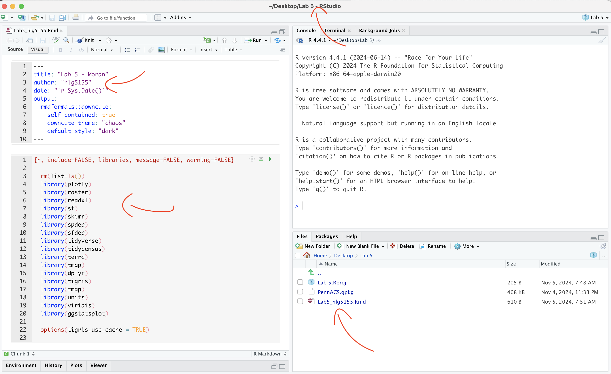
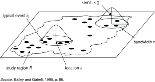
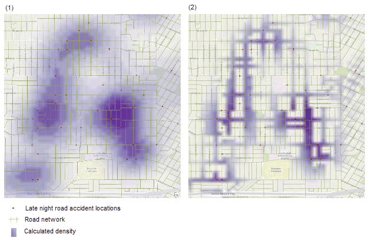
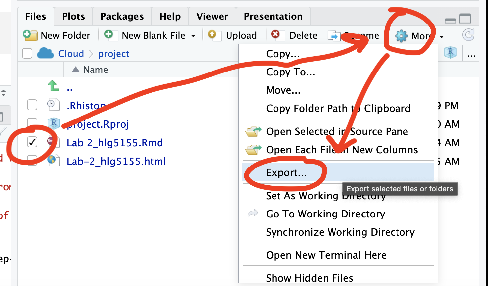
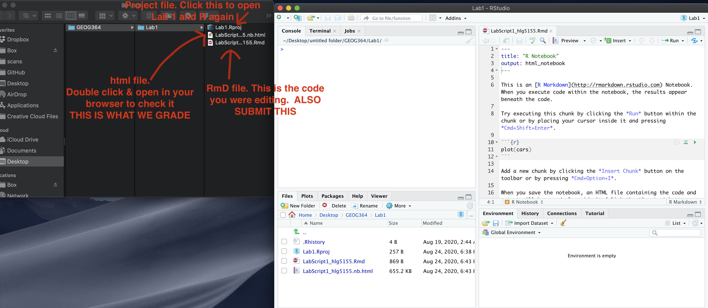

```{r, include=FALSE, echo=FALSE,results='hide',warning=FALSE, message = FALSE}
knitr::opts_chunk$set(echo = TRUE, warning=FALSE, message = FALSE)

# THE FORMAT YOU LIKE IS LAB 3 INSIDE 2022

# invisible data read
library(tidyverse)
library(sp)
library(sf)
library(readxl)
library(skimr)
library(ggplot2)
library(tmap)
library(viridis)
library(kableExtra)
library(plotly)
library(readxl)
library(osmdata)
library(tigris)
library(elevatr)
library(tidycensus)
  library(spdep)
  library(sfdep)
library(RColorBrewer)
  library(rmapshaper)
library(spatstat)


```

<br>

## Welcome to your final Lab!

<br>

### Aims

Today’s lab explores point pattern analysis, especially density and distance based approaches for a case study in New York <br>

```{=html}
<p class="comment"><strong>THIS IS YOUR FINAL LAB. <br> It is shorter to take into account the fact you have less time.</strong></p>
```
<br><br>

## A. Set-up - NEW LIBRARIES

Seriously, please don't skip this. It's the biggest cause of lab issues.

<br>

### A1. Create a Lab 6 project

First, you need to set up your project folder for lab 6, and install packages if you are on the cloud.

<details>

<summary>POSIT CLOUD people, click here to install packages..</summary>

<br>

**Step i:**<br>Go to <https://posit.cloud/content/> and make a new project for Lab 5 <br><br>

**Step ii:**<br>Run this code IN THE CONSOLE to install the packages you need. <br>

-   This is going to take 5-10 minutes, so let it run and carry on. <br><br>

```{r, eval=FALSE}

# COPY/PASTE THIS IN THE CONSOLE QUADRANT, 
# DON'T PUT IT IN A CODE CHUNK 

install.packages("readxl")
install.packages("tidyverse")
install.packages("ggplot2")
install.packages("ggstatsplot")
install.packages("plotly")
install.packages("dplyr")
install.packages("skimr")
install.packages("rmdformats")

install.packages("remotes")
remotes::install_github(repo = "r-spatial/sf", 
                        ref = "93a25fd8e2f5c6af7c080f92141cb2b765a04a84")

install.packages("terra")
install.packages("tidycensus")
install.packages("tigris")
install.packages("tmap")
install.packages("units")
install.packages("spdep")
install.packages("sfdep")
install.packages("rmapshaper")
# NEW
install.packages("spatstat")


# If you get a weird error it might be that the quote marks have messed up. 
# Replace all of them and ask Dr G for a shortcut.

```

<br><br>

**Step iii:** <br>Go to the Lab Canvas page and download the data AND the lab report. Upload each one into your project folder.<br>*Forgotten how? See Lab 2 Set-Up.* <br>

<br>

</details>

::: small-gap
:::

<details>

<summary>R-DESKTOP people, click here to create your lab project.</summary>

<br>

::: collapsible-content
<iframe src="pindent_Tut2b_ProjectsDesktop.html" style="width: 100%; height: 700px; border: none;">

</iframe>
:::

</details>

<br><br>

### A2. Add your data & lab template

Go to Canvas and download the lab template and datasets for this week's lab. Should be one dataset and one lab template. Immediately put it in your lab 6 folder (or upload it if you're on the cloud. Rename the lab template to something with your email ID, then open it.

<br><br>

### A3. Change the YAML Code

The YAML code sets up your final report. Changing the theme also helps us to not go insane when we're reading 60 reports. Expand for what you need to do.<br>

<details>

<summary>Step A3 Instructions</summary>

<br>

**Step i:** Change the AUTHOR line to your personal E-mail ID <br><br>

**Step ii:** Go here and choose a theme out of downcute, robobook, material, readthedown or html_clean: <https://github.com/juba/rmdformats?tab=readme-ov-file#formats-gallery>.<br> *DO NOT CHOOSE html_docco - it doesn't have a table of contents* <br><br>

**Step iii:**<br>Change the theme line on the template YAML code to a theme of your choice. See the example YAML code below <br> *Note, downcute chaos is different - see below*<br><br>

1.  Example YAML code if you want `robobook`, `material`, `readthedown` or `html_clean`. You can also change the highlight option to change how code chunks look. - see the rmdformats website.

```{r,eval=FALSE}

---
title: "Lab 6"
author: "ADD YOUR EMAIL ID"
date: "`r Sys.Date()`"
output:
  rmdformats::robobook:
    self_contained: true
    highlight: kate
---

```

<br>

2.  Example YAML code if you want `downcute` or `downcute chaos`. For white standard downcute, remove the downcute_theme line..

```{r,eval=FALSE}

---
title: "Lab 6"
author: "ADD YOUR EMAIL ID"
date: "`r Sys.Date()`"
output:
  rmdformats::downcute:
    self_contained: true
    downcute_theme: "chaos"
    default_style: "dark"
---
      
```

<br><br>

</details>

<br><br>

### A4. Add the library code chunk

**DO NOT SKIP THIS STEP (or any of them!).** Now you need to create the space to run your libraries. Expand for what you need to do.<br>

<details>

<summary>Step A4 Instructions</summary>

<br>

**Step i:** At the top of your lab report, add a new code chunk and add the code below. <br><br>

**Step ii:** Change the code chunk options at the top to read <br> `{r, include=FALSE, warning=FALSE, message=FALSE}` and try to run the code chunk a few times <br><br>

**Step iii:** If it works, all 'friendly text' should go away. If not, look for the little yellow bar at the top asking you to install anything missing, or read the error and go to the install 'app-store' to get any packages you need. <br><br>

```{r, eval=FALSE}

# spatstat is  NEW package for you (probably). Install if necessary.

  rm(list=ls())
  library(plotly)
  library(raster)
  library(readxl)
  library(sf)
  library(skimr)
  library(tidyverse)
  library(tidycensus)
  library(terra)
  library(tmap)
  library(dplyr)
  library(tigris)
  library(tmap)
  library(units)
  library(viridis)
  library(ggstatsplot)
  library(rmapshaper)
  library(spatstat) # NEW!  You might have to install this.
 
  options(tigris_use_cache = TRUE)

```

<br><br>

</details>

<br><br><br>

### **STOP AND CHECK**

```{=html}
<p class="comment"><strong>STOP!</strong> Your screen should look similar to the screenshot below (although it would be lab 6 and your folder would be inside GEOG364).<strong>If not, go back and redo the set-up!</strong></p>
```
{width="100%"}

<br>

```{=html}
<p class="comment"><strong>IMPORTANT! You are in charge of keeping your final report neat with easy to find answers. For example this includes surpressing library loading code chunk outputs, putting in headings/sub-headings, writing clear answers under your code and linking your answers to the real-world. <br><br> 100% is reserved for exceptionally professional labs, it's your final one, so impress us! (I can use it as evidence if I write you reference letters in the future..) </strong></p>
```
<br><br>

### A5. Reading in the data

The aim of this lab is to look at two point patterns: high-schools and McDonalds across New York State. First we need to get the data.

1.  Make sure you followed the instructions above and that Lab6_SpatialData_NY.RData is your Lab 6 folder.<br><br>

2.  RData files are a special way of storing data that is unique to R. Essentially you load this file and you see what data was on my screen. This means you don't have to spend a lot of time reading all the datasets into your computer.<br><br>

3.  Create a new code chunk in section A, and use the load command to open the data into R. It will only work if the file is in your project folder. For example, this is how I will do it with my teacher's version.

```{r}
# your file is called something else
load("Lab6Teachers.RData")
```

<br><br>

### A6. Check the data loaded correctly

**IMPORTANT! Make sure that you have run the library code chunk including the spatstat package or the next bit won't work.**<br><br>

1.  Look at the Environment tab and you'll see several datasets have appeared:

    -   `median_income` and `pop_density` are derived from census tract vector data from the American Community Survey. Rather than our normal vector format, they are saved as *raster images* (to make the point pattern code work). <br>

    -   `Schools` is a point dataset containing the location of all the high-schools in New York State.<br>

    -   `McDonalds` is a dataset containing the location of all the McDonalds resturants in New York State. <br><br>

2.  In a code chunk, write the name of median_data and use the [**plot**]{.underline} command to make a plot of the median_income data. You should see this.

```{r, include=FALSE}
oldmedincome <- median_income
median_income <- NYmedian_income
oldowin <- stateborder.utm
stateborder.utm <- NYstateborder.utm

```

```{r}
# THIS WILL ONLY WORK IF YOU HAVE RUN THE LOAD LIBRARY CODE CHUNK TO LOAD THE SPATSTAT PACKAGE. If you see a list of stuff and it doesn't make a map, install and load library(spatstat)
```

```{r}
median_income
plot(median_income)

```

```{r,include=FALSE}
NYmedincome <- median_income
median_income <- oldmedincome

```

<br>

3.  Repeat the step above for the population density dataset, `pop_density` to make sure that has loaded correctly.

<br><br>

## B. Data Exploration & Wrangling

### B1. Understanding the spatial point pattern of schools across NY State

1.  One of the variables I loaded was called `Schools`. Using tmap's qtm command (see previous labs or here), make a nice map of the variable and describe any spatial patterns you see, focusing especially on the autocorrelation of the points and any processes that might cause it. <br><br>\
    -   *You do not need to look at any variables in particular (although feel free to color the points if you want), I just care about the locations of the schools themselves.*<br>\
    -   *You also have the NYState border saved as* `stateborder.utm` \*if you wish to use it.\
    -   *Hint, see previous labs for examples of using tmap and tm_dots(), or nice examples here (scroll down to find them) <https://jamescheshire.github.io/learningR/mapping-point-data-in-r.html#loading-point-data-into-r>*<br>

<br><br>

### B3. Understanding the spatial point pattern of McDonalds across NY State

1.  Repeat what you did for the `McDonalds` data. As part of your description, compare and contrast this pattern with the schools data.

<br><br>

### B3. Describing the Spatstat package.

There is a specific package designed to do point pattern analysis called spatstat. It's a bit old fashioned (hence the weird image files) but it does point pattern very well. It is also linked to a textbook and many online materials.

1.  Go to this website and look around <https://spatstat.org/FAQ.html> In your report, in at least 50 words, describe what spatstat is and any interesting features you see.

<br><br>

### B4. Converting our data into ppp format

All point pattern analysis tools used in this tutorial are available in the `spatstat` package. These tools are designed to work with points stored in custom `ppp` formats and *not* as the `sf` data you are used to using (e.g. tmap stops working from this point onwards).

1.  First we need to turn our NY state border into a custom spatial "owin" "window frame", This will allow us to make our spatial domain NY state rather than a rectangle.\
    \
    Get the code working below in your own lab.

```{r}

state.owin <- as.owin(stateborder.utm)

```

<br><br>

2.  We are going to work with *unmarked* data (for now). So for each of Schools and McDonalds, we need to first only use the geometry (X/Y locations) and then convert it to a ppp format, then assign our window as New York.\
    \
    Get the code working below in your own lab. You should see a version of the map where it's easier to see the point patterns.

```{r,results="hide"}
# Just take XY locations
School.locs  <- st_geometry(Schools)

# Convert to point pattern format
School.ppp  <- as.ppp(School.locs)

# Set the domain to be NY State
Window(School.ppp) <- state.owin

# and plot
plot(School.ppp, pch=16, cols=rgb(0,0,0,.5),cex=.5)

```

<br><br>

3.  Repeat for the McDonalds data to make a ppp version of that. You should see something like this map.

```{r,echo=FALSE, include=FALSE}
# Just take XY locations
McDonalds.locs  <- st_geometry(McDonalds)

# Convert to point pattern format
McDonalds.ppp  <- as.ppp(McDonalds.locs)

# Set the domain to be NY State
Window(McDonalds.ppp) <- state.owin

```

```{r}

plot(McDonalds.ppp, pch=16, cols=rgb(0,0,0,.5),cex=.5)

```

<br>

```{=html}
<p class="comment"><strong>If your lab template said something about mean centres, ignore and move on. You got a *very* early version of the template and it's no longer in the lab </strong></p>
```
<br><br>

## C. Density based point pattern analysis.

A *first order* property of a pattern concerns itself with the variation of the observations’ density across a study area. For example, the distribution of oak trees will vary across a landscape based on underlying soil characteristics (resulting in areas having dense clusters of oaks and other areas not). This allows us to take into account the non uniformity of space.

### C1. Converting units to km

*(this might be missing from your lab template, add it in!)*

At the moment all our units are in m. This is going to make the analysis hard to write up given we're looking at all of New York State.

1.  Let's convert ALL our data's units to km. Get this code working in your report.
    -   *IF YOU GET ERRORS TELL YIFEI (This is the code chunk causing Dr G problems..). If it really doesn't work, ignore this section, re-run all your code and move on (just reporting your answers in m)*

```{r}
library(spatstat) 
School.ppp    <- rescale(School.ppp, 1000, "km")
McDonalds.ppp <- rescale(McDonalds.ppp, 1000, "km")
median_income <- rescale(median_income, 1000, "km")
pop_density   <- rescale(pop_density, 1000, "km")

```

<br><br>

### C2. Global density

*(this might be missing from your lab template, add it in!)*

A basic measure of a pattern’s density is its overall, or **global** **density**. E.g. how many points are there per unit area:

$$
\text{Global density} = \frac{\text{number points}}{\text{study area}}
$$

here's how to do this for a ppp dataset, in this case the schools data.

```{r}

# Number of points
num_points <- npoints(School.ppp)
num_points

# Area of the study region
study_area <- area.owin(Window(School.ppp))
study_area

# Global density in m^2
global_density <- num_points / study_area
global_density


```

So this code suggests that in New York State, there are 0.0072 schools per square km. E.g. if the schools were evenly distributed in a grid-like pattern, the average distance between schools would be around 12 kilometers in any direction.

-   *1/0.0072 \~ 139, this means if schools were evenly distributed in a grid like pattern then there would be roughly one school every 139 square kilometers. Taking the square root of 139 gives about 11.79, so if the schools were evenly distributed in a grid-like pattern, the average distance between schools would be approximately 12 kilometers in each direction.*

1.  **Calculate and explain the global density of the McDonalds dataset.**

<br><br>

### C3. Local density - Kernel smoothing

First, we could simply turn our dots into a heatmap. e.g. areas with a high intensity of dots are marked differently. The easiest way to do this is using a process called Kernel Density Smoothing. We will talk about this in class, but essentially we're just moving a circle (or some other shape) over the data and counting how many points are inside it. So it's a moving weighted mean.



Its bandwidth is the size of the circle and defines the kernel’s window extent.

<br>

1.  The code is very easy, we simply use the density command. Here is the code to calculate density of the schools data using a default bandwidth. Get this code working and make another similar code chunk for the McDonald's data.

```{r, results="hide"}
SchoolDensity1 <- density(School.ppp) # Using the default bandwidth
plot(SchoolDensity1, main=NULL, las=1)
contour(SchoolDensity1, add=TRUE)
```

At least your schools map might look pretty boring with the default bandwidth (think about why)

<br>

#### Adjusting the bandwidth

{width="90%"}

Different bandwidth/circle-sizes tell us differnet things about the data. For example in the example above a large bandwidth shows the areas of the city most prone to late night road accidents. A smaller bandwidth shows the exact streets, but it's harder to get an overall picture.

THERE IS NO CORRECT BANDWIDTH - but adjusting it often tells you different stories about the data.

<br>

1.  Edit the code you just wrote to include the sigma option. E.g. sigma=50 means you're using a circle of size 50km to smooth the data. sigma=5 means you're using a circle of size 5km. E.g.

```{r, results="hide"}
SchoolDensity <- density(School.ppp, sigma=100000) 
plot(SchoolDensity, main=NULL, las=1)
contour(SchoolDensity, add=TRUE)
```

2.  See if you can adjust the bandwidth for Schools and McDonald's to say something interesting about each pattern, linking it to the underlying geography/envrionment (e.g. these are real school/Mcdonalds locations, what's going on) Explain your process/ reasoning below your maps. <br><br>

### C4. Quadrat analysis

*Here is a GREAT description of quadrat analysis, describing the hypothesis test used and its interpretation. This will also be part of your homework. Use this document to answer the text/analysis part of the questions below. E.g. I will only help you through the code.*

<https://psu.instructure.com/courses/2328607/files/folder/1_Readings?preview=171032062>

*(if you can't see this, go to Lab 6 on Canvas, - it's Chapter 14B McGrew on quadrat analysis)*

<br>

We can also apply a similar approach to assess whether our dots are clustered together or not. The easiest form of this is called quadrat analysis.

1.  Using the resources above, write around 100 words explaining what quadrat analysis and the Variance-Mean-Radio are.

<br><br>

## WEEK 2

## WK2 -Updates - IMPORTANT

### WK2 -Update 1. PLOTS

Hello from Dr G! First, I have finally found a way for you to better see your plots below a code chunk - I know the ppp ones have been difficult to make out as they appear tiny.

What we do is change the margin of the plot using the "plotting parameters" `par()` command BEFORE making the plot. There are MANY things you can change using this command\
- see `?par` for more options

*Fore, this fix will also work for any of the "base" plot functions that we tried in Lab 3.*

-   **[TASK] From section B4 onward, change ALL your plot commands so that they first have this par() line.**

```{r}

# FIRST USE PAR() to sets the borders and text size.
par(oma=c(0,0,0,0),mar=c(.5,.5,1,.5),cex.main=.9)

#Then plot. note, you can change things like the color and transparency of the points using rgb(), or try pch=4 for little crosses. 
plot(School.ppp, pch=16, 
     cols=rgb(0,0,0,.5),cex=.5,
     main="Point pattern of NY schools data")
```

or

```{r}


SchoolDensity1 <- density(School.ppp) # Using the default bandwidth

par(oma=c(0,0,0,0),mar=c(.5,.5,1,.5),cex.main=.9)
plot(SchoolDensity1, main=NULL, las=1)

# you can turn off contours to better see the colors also by removing the line below
contour(SchoolDensity1, add=TRUE)

# or add the points if useful to understand what is happening
plot(School.ppp, pch=16, 
     cols=rgb(1,1,1,.5),cex=.4,add=TRUE)

```

<br><br>

### WK2 -Update 2. SUBSET TO WEST NY

Secondly, I update these datasets annually and it seems there are now SO MANY schools and McDonalds in New York that it is skewing the dataset. So lets do a quick fix to only look at the West part of the State. This will also handily remove the State Park.

Run this code, and all your future analyses will be much more interesting. If this was a professional project, I would split them in two and do this analysis on each case. I would also make this more elegant, but it works for now :)

<br>

-   **[TASK] - get the code below running in your report, remembering to hide code chunk output**

```{r, results="hide"}

# SET YOUR CODE CHUNK OPTION TO results="hide", or this will be ugly when knitted

# Load New York counties data
ny_counties <- counties(state = "NY", cb = TRUE, class = "sf")

# Define the latitude boundary
longitude_boundary <- -74.8

# Filter counties west of the given longitude
# Ensure CRS matches Schools
# Fix invalid geometries
ny_counties_west <- ny_counties %>%
  filter(st_coordinates(st_centroid(geometry))[, 1] < longitude_boundary) %>%
  st_transform(crs = st_crs(Schools)) %>% 
  st_make_valid()                               

# Get only the points in the new area
west_schools  <- st_intersection(Schools, ny_counties_west)
west_McDonalds <- st_intersection(McDonalds, ny_counties_west)

#---------------------------
# then reconvert to ppp. 
west.owin <- as.owin(ny_counties_west)

SchoolWest.ppp     <- as.ppp(st_geometry(west_schools))
McDonaldsWest.ppp  <- as.ppp(st_geometry(west_McDonalds))

Window(SchoolWest.ppp)    <- west.owin
Window(McDonaldsWest.ppp) <- west.owin

# and change units. Just in case I'm reloading spatstat
library(spatstat) 
SchoolWest.ppp    <- rescale(SchoolWest.ppp, 1000, "km")
McDonaldsWest.ppp <- rescale(McDonaldsWest.ppp, 1000, "km")
west.owin         <- affine(west.owin, mat = diag(c(1 / 1000, 1 / 1000)))


```

<br>

-   **[TASK] -Then use this code chunk to check it works**

```{r}
# and plot to check it works
par(oma=c(0,0,0,0),mar=c(.5,.5,1,.5),cex.main=.9)
plot(SchoolWest.ppp, pch=1, cols=rgb(0,0,0,.5),cex=.5,
     main="Point pattern of schools and McDonalds (red) in West NY-State")
plot(McDonaldsWest.ppp, pch=20, cols=rgb(1,0,0,.5),cex=.5,add=TRUE)

# and plot densities

SchoolWestDensity <- density(SchoolWest.ppp, sigma=10) 
plot(SchoolWestDensity, main=NULL, las=1)
contour(SchoolWestDensity, add=TRUE)


McDonaldsWestDensity <- density(McDonaldsWest.ppp, sigma=10) 
plot(McDonaldsWestDensity, main=NULL, las=1)
contour(McDonaldsWestDensity, add=TRUE)

```

<br><br>

### WK2 -Update 3. DENSITY CHECK

-   **[Task],** you can now use these code chunks to re-run the density plots.

```{r}

# and check densities
SchoolWestDensity <- density(SchoolWest.ppp, sigma=10) 
plot(SchoolWestDensity, main=NULL, las=1)
contour(SchoolWestDensity, add=TRUE)

```

```{r}
# and check densities
McDonaldsWestDensity <- density(McDonaldsWest.ppp, sigma=10) 
plot(McDonaldsWestDensity, main=NULL, las=1)
contour(McDonaldsWestDensity, add=TRUE)
```

<br>

-   **[TASK] . In the text below the plots, explain the NEW difference between the McDonalds and Schools data.**

    -   *HINT, In the point pattern plots above the patterns look quite different, but here they are similar. Explain what this means for the interpretation of the pattern going on, referring to the processes that "cause" a school or McDonalds.*

<br><br>

### C4. Quadrat continued

We spent much of week 15 talking about quadrat analysis. In R, we can do this using the quadratcount command, where nx and ny choose the number of gridcells

Here's an example, where I divide the Schools data in 9 grid-cells, or quadrats - 3 quadrats in the x direction and 3 in the y direction. You can see that because NY is a weird shape, it ignores the ones outside our range.

```{r}

Quad.School <- quadratcount(SchoolWest.ppp, nx = 3, ny = 2)

# and plot

par(oma=c(0,0,0,0),mar=c(.5,.5,1,.5),cex.main=.9)
plot(SchoolWest.ppp,       
     cex = 0.5, pch = 4, # point size and shape    
     main="Schools quadrat count") # plot title

plot(Quad.School, add = TRUE, cex = 2)  # Now I add Q on top.
```

Alternatively, we can plot the intensity, because the colours make it simpler to see patterns. This time, I added the points on top.

```{r}
# Plot the intensity
par(oma=c(0,0,0,0),mar=c(.5,.5,1,.5),cex.main=.9)


# better colors. you might need to install the RColorBrewer package
# choose your own palette here!
# https://earlglynn.github.io/RNotes/package/RColorBrewer/index.html
 
my_colours <- RColorBrewer::brewer.pal(8, "YlGnBu")[-8]  
# Specify the number of colors and remove the darkest

plot(intensity(Quad.School, image=TRUE),
     col=my_colours, 
     main="Point intensity of schools", las=1)  
plot(west.owin,add=TRUE)

```

<br>

-   **[TASK] Get the code running in your report, but in your case, run your analysis with 6 quadrats in each direction.**

<br>

-   **[TASK] - According to my plot above, I think that there should be most points in the West. Do you agree from your analysis? What effect are we describing here? (hint, in the lecture notes and linked to gerrymandering)**

<br>

#### Hypothesis tests

Now let's run a hypothesis test to see if overall the data is likely to come from an independent random process.

The code is **`quadrat.test(DATA ,nx=X, ny=Y)`** where you replace DATA, X and Y with your dataset and number of quadrats.

-   **[TASK]** Use the `quadrat.test() command` on the `SchoolWest.ppp` dataset with 6 quadrats in each direction. Below, write out a FULL hypothesis test that assesses whether the SCHOOLS data is likely to come from an IRP. . E.g. I expect you to write your hypotheses, results and conclusion below the code.\

    <br>\

-   **[Advanced\*\* \*\*TASK]** Go back to section A1 and B4 and take a look at your schools points. What nuance is your test result missing e.g. do you agree with its results at every scale and location?

<br><br>

### C5. Relationship with covariates

You can skip this section! For those interested in how to go deeper into using density based analyses to assess how schools etc link with population density,

<https://mgimond.github.io/Spatial/chp11_0.html>

<br><br>

## Check point

**If you reach this point and submit, I will award you between a C and a B (depending on how well you did). If you wish to get a higher grade, please continue.**

<br><br>

## D. Distance based point pattern analysis

This part is based on week 16's classes.

### D1. Nearest neighbours

The `nndist` command calculates the distance of the nearest neighbour for every point. Here is how I would examine the range of nearest neighbours for the school and look at the average.

```{r}

SchoolWest.nn <- nndist(SchoolWest.ppp)

#now I make a histogram of nearest neighbours
par(mar=c(5,5,2,2))
hist(SchoolWest.nn,br=30,
     xlab="Distance between nearest neighbours",
     ylab="Frequency");
box()

```

<br>

We can now easily calculate the average nearest neighbor distance using the mean command. I have rounded the answer to 3 decimal places. As you can see Schools in West NY State, are on average 8.58km apart.

```{r}

round(mean(SchoolWest.nn),3)

```

<br>

Finally, we can calculate the R.Ratio and see if it is unusal compared to a pattern caused by an IRP.

```{r}
clarkevans.test(SchoolWest.ppp)

```

-   **[TASK] Get this analysis running for the McDonalds data. Compare your results with mine.** Explain what is going on and any similarities or differences that relate to the underlying process of how schools were "created" vs "mcdonalds"?\

-   **[TASK] Also explain.**<br>**\#**

    -   What would the clarke evens ratio, R, be for very dispersed data?<br>

    -   What would the clarke evens ratio, R, be for very clustered data?<br>

-   **[TASK] Also explain**<br>

    1.  What are edge effects in point pattern data? Are they going be an issue for this SPECIFIC dataset/analysis and why?<br>

    2.  What is the locational fallacy? Is it going going be an issue for this SPECIFIC dataset/analysis and why?<br>

-   \
    \

<br><br>

### D3. Ripley's L-Function

We will now conduct an L-Function analysis on the data. This is a version of Ripley's K that is easier to interpret. This code won't show any output if it runs correctly because I've saved all the outputs to variables.

-   **[TASK] - get the code below working for the McDonalds data and explain what is going on (Wednedays lecture will help) - or look up Ripley's K and L.**

    -   ADVANCED, explain what the grey cloud means and why you get that wiggle at small distances\

    -   IF THIS DOESN'T WORK FOR YOU, YOUR COMPUTER ISN'T POWERFUL ENOUGH - People on Posit cloud, take a screenshot of my results, put it in your report and explain that.

```{r}
# Calculate the L function. 
Schools_L <- Lest(SchoolWest.ppp,correction = "Ripley")

# Create an ensemble (collection) of simulated point patterns 
# that is based on our data data, 
# but the points have been rearranged using an independent random process. 
# For each one, calculate the L function, lest. 

#It will take a minute to run. ideally we would want many more simulations
# 
IRPsimulation <- envelope(SchoolWest.ppp, 
                              Lest, correction = "Ripley", 
                              verbose = F,
                              nsim=20, nrank=1, 
                              savepatterns = FALSE, savefuns = FALSE)
```

Now we can plot the data. This command is horrible, just copy/paste changing longleaf to your market data. I will look for a better one!

```{r}
#Find the max and min values
L_Max<-(max(Schools_L$iso-Schools_L$r))
L_Min <- 0-L_Max

#The dots are weirdly important here. Copy/paste
plot(Schools_L,. - r ~ r, ylim=c(L_Min,L_Max))

# Add IRP simulated Lestimates (so many, they merge into a grey cloud)
plot(IRPsimulation, . - r ~ r,add=TRUE)
```

<br><br>

### LAB IS COMPLETE!

You will be graded on a similar rubric to lab 5\
<br><br>

## SUBMITTING LAB 6

Remember to save your work throughout and to spell check your writing (next to the save button). Now, press the knit button again. If you have not made any mistakes in the code then R should create a html file in your lab6 folder, complete with a very recent time-stamp.

<br>

### If you use the POSIT cloud website

You can download each of your .RmD and html files by:

-   Clicking on the little box next to the Rmd in the Files tab, then going to the little blue cogwheel (might need to make your Rstudio full screen) and clicking export.<br>

```{r, Lab2FigDownload, echo=FALSE,fig.align='center',out.width="90%"}

```

-   Repeat the process exactly for the html file underneath it (e,g, just have the html clicked.)<br>

-   Now go to Canvas and submit BOTH your html and your .Rmd file in Lab 3

<br>

### If you use the RSTudio desktop on your own computer

-   Press knit!

-   Go to your Lab 6 folder, In that folder, double click on the html file. This will open it in your browser. CHECK THAT THIS IS WHAT YOU WANT TO SUBMIT <br>

-   Now go to Canvas and submit BOTH your html and your .Rmd file in Lab 6.<br>

```{r, echo=FALSE}

```

<br>

## GRADING CHECK-LIST

[110 marks total]

### What does your grade mean?

Overall, here is what your lab should correspond to:

```{r, echo=FALSE}
rubric <- readxl::read_excel("pg_364Lab_rubrictable.xlsx")
knitr::kable(rubric) %>%   
  kable_classic_2() %>%
  kable_styling(bootstrap_options = c("striped", "hover", "responsive"))


```
